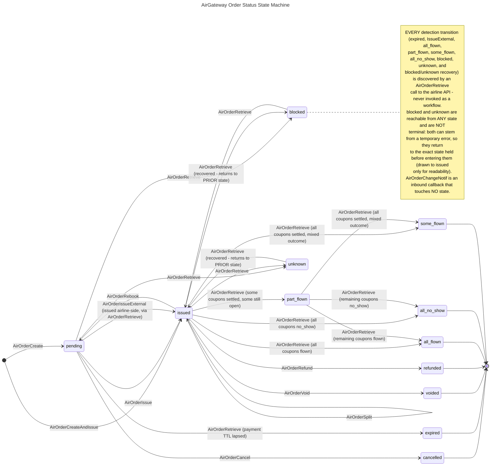
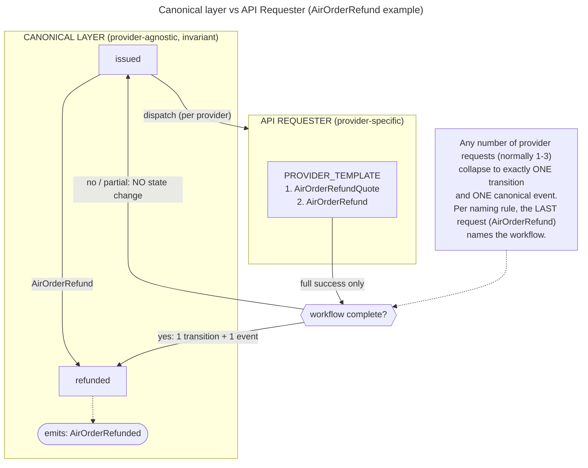

# Order State Machine — Single Source of Truth

> **Canonical workflow — single source of truth.** This document is *the*
> authoritative definition of order **states**, **workflows**, and **events** for the
> AirGateway platform. All layers — persistence, controller/service, API, and front
> end — MUST conform to the exact names and transitions defined here. Do not invent
> states, rename identifiers, or add transitions without updating this file via PR.
>
> This file supersedes and replaces the retired skill
> `agw-v2-order-status-lifecycle`. There is no other authority; if any code, doc, or
> skill contradicts this file, this file wins and the other must be corrected.

## Naming conventions

- **States** — lowercase `snake_case` (`pending`, `all_flown`). Stored values MUST
  match exactly; display labels may differ but stored values may not.
- **Workflows** — `Air`-namespaced PascalCase (`AirOrderCreate`, `AirOrderVoid`).
- **Events** — PascalCase, past tense (`AirOrderCreated`, `AirOrderIssued`, `AirOrderReissued`).
  `AirOrderSplit` conforms despite matching its workflow name: the past participle of
  *split* is *split* — a syntactic overlap, not an exception to the rule.
- **Workflow naming rule** — a workflow takes its name from its **last (terminating)
  request** in the API Requester. The final request that completes the workflow is the
  one that gives the workflow its name (e.g. a sequence ending in `AirOrderVoid` is the
  `AirOrderVoid` workflow).

## Diagram

## States

There are exactly **12** canonical statuses. No others are valid.

The three coupon-derived EXIT statuses (`all_flown`, `some_flown`, `all_no_show`) are
valid **only** when every coupon has reached a dead end (`flown` or `no_show`) — that
coupon-level validation is what makes them terminal.

| State | Kind | Meaning |
|---|---|---|
| `pending` | Entry / active | Order created but not yet issued. Awaiting ticketing/payment within the time limit. |
| `issued` | Active | Order issued and held by the airline. The main operational state and central hub. |
| `cancelled` | Terminal | Order cancelled before issuance via `AirOrderCancel`. |
| `expired` | Terminal | Payment time limit lapsed while `pending`. Time-driven, airline-side; surfaced via `AirOrderRetrieve`. |
| `voided` | Terminal | Issued order voided via `AirOrderVoid`. |
| `refunded` | Terminal | Issued order refunded via `AirOrderRefund`. |
| `all_flown` | Terminal (EXIT) | Every coupon resolved to `flown`. Derived, terminal. |
| `some_flown` | Terminal (EXIT) | Every coupon settled, with a **mixed** outcome (some `flown`, some `no_show`). Derived, terminal. |
| `all_no_show` | Terminal (EXIT) | Every coupon resolved to `no_show`. Derived, terminal. |
| `part_flown` | Transitional (never terminal) | **Some** coupons are on a dead-end status, at least one is still open. Temporary by definition; re-evaluated on every `AirOrderRetrieve` and eventually advances to `all_flown`, `some_flown`, or `all_no_show`. |
| `blocked` | Exceptional (non-terminal) | Airline reports the order as blocked. Reachable from **any** state via `AirOrderRetrieve`. May stem from a temporary error, so a later `AirOrderRetrieve` may return the order to the state it held before. |
| `unknown` | Exceptional (non-terminal) | Airline response does not map to a known state. Reachable from **any** state via `AirOrderRetrieve`. May stem from a temporary error, so a later `AirOrderRetrieve` may return the order to the state it held before. |

## Workflows → Transitions → Events

The authoritative contract. Each row binds a **trigger** to a **transition** and the
**event** it emits. The **Direction** column distinguishes the three kinds of trigger:
*outbound* (workflows we invoke against the airline), *detection* (airline-side
outcomes surfaced via `AirOrderRetrieve` — **every** detection transition is discovered by an `AirOrderRetrieve`, not only `blocked`/`unknown`), and *inbound* (callbacks the airline pushes to us).

| Workflow / trigger | Direction | From → To | Emitted event |
|---|---|---|---|
| `AirOrderCreate` | outbound | start → `pending` | `AirOrderCreated` |
| `AirOrderCreateAndIssue` | outbound | start → `issued` | `AirOrderIssued` |
| `AirOrderIssue` | outbound | `pending` → `issued` | `AirOrderIssued` |
| `AirOrderCancel` | outbound | `pending` → `cancelled` | `AirOrderCancelled` |
| `AirOrderVoid` | outbound | `issued` → `voided` | `AirOrderVoided` |
| `AirOrderRefund` | outbound | `issued` → `refunded` | `AirOrderRefunded` |
| `AirOrderRebook` | outbound | `issued` → `pending` | `AirOrderRebooked` |
| `AirOrderRebookAndIssue` | outbound | `issued` → `issued` | `AirOrderReissued` |
| `AirOrderSplit` | outbound | `issued` → `issued` (+ new order in `issued`) | `AirOrderSplit` |
| `AirOrderIssueExternal` — `AirOrderRetrieve` (order issued airline-side, outside the platform) | detection | `pending` → `issued` | `AirOrderIssuedExternal` |
| `AirOrderRetrieve` (payment time limit lapsed) | detection | `pending` → `expired` | `AirOrderExpired` |
| `AirOrderRetrieve` (all coupons flown) | detection | `issued` → `all_flown` | `AirOrderAllFlown` |
| `AirOrderRetrieve` (some coupons settled, some still open) | detection | `issued` → `part_flown` | `AirOrderPartFlown` |
| `AirOrderRetrieve` (all coupons settled, mixed outcome) | detection | `issued` → `some_flown` | `AirOrderSomeFlown` |
| `AirOrderRetrieve` (all coupons no_show, itinerary elapsed) | detection | `issued` → `all_no_show` | `AirOrderAllNoShow` |
| `AirOrderRetrieve` (remaining coupons flown) | detection | `part_flown` → `all_flown` | `AirOrderAllFlown` |
| `AirOrderRetrieve` (all coupons settled, mixed outcome) | detection | `part_flown` → `some_flown` | `AirOrderSomeFlown` |
| `AirOrderRetrieve` (remaining coupons no_show) | detection | `part_flown` → `all_no_show` | `AirOrderAllNoShow` |
| `AirOrderRetrieve` (airline reports blocked) | detection | *any* → `blocked` | `AirOrderBlocked` |
| `AirOrderRetrieve` (response unmappable) | detection | *any* → `unknown` | `AirOrderUnknown` |
| `AirOrderRetrieve` (block cleared / temporary error resolved) | detection | `blocked` → *prior state* | `AirOrderUnblocked` |
| `AirOrderRetrieve` (state mappable again / temporary error resolved) | detection | `unknown` → *prior state* | `AirOrderRecovered` |
| `AirOrderRetrieve` (no change detected) | detection | *none — state unchanged* | *none* |
| `AirOrderAddServices` | outbound | `issued` → `issued` (servicing, no status change) | `AirOrderServicesAdded` |
| `AirOrderAddSeats` | outbound | `issued` → `issued` (servicing, no status change) | `AirOrderSeatsAdded` |
| `AirOrderRemoveServices` | outbound | `issued` → `issued` (servicing, no status change) | `AirOrderServicesRemoved` |
| `AirOrderRemoveSeats` | outbound | `issued` → `issued` (servicing, no status change) | `AirOrderSeatsRemoved` |
| `AirOrderChangeNotif` | inbound (airline callback) | *none — no status change* | `AirOrderChangeNotified` (carries `TYPE`) |

Any `(from, to)` pair not in this table is **invalid** and must be rejected.

Notes on the detection rows:

- **`AirOrderIssueExternal`** is a *named detection transition*, not an outbound
  workflow: the airline issued the order outside the platform and the fact is
  surfaced by an `AirOrderRetrieve`. It exists so that Rule 8 (airline state
  overrides local state) has an explicit `(pending, issued)` row.
- **`blocked` → *prior state*** and **`unknown` → *prior state*** restore the exact
  state the order held immediately before entering `blocked`/`unknown` (which may be
  a terminal state). The prior state MUST be preserved when entering either status.
- **A no-change `AirOrderRetrieve` is a no-op.** When the retrieve confirms the
  current state, no transition occurs and no event is emitted. The table row exists
  to make this explicit; it is the common case.

## `AirOrderChangeNotif` — inbound callback

`AirOrderChangeNotif` is a callback the **airline sends to us**. It is strictly
associated with an order but has **no implication on order status** — it never
transitions the state machine. It may arrive while the order is in any non-terminal
state and must be treated as informational. Each notification is recorded with a
`TYPE`, and emits a single `AirOrderChangeNotified` event carrying that `TYPE`.

### `TYPE` values (canonical enum)

The notification `TYPE` is its own canonical list. `AirOrderChangeNotified` always
carries exactly one of the following values. None of them transition the state machine.

| # | TYPE |
|---|---|
| 1 | `Bereavement` |
| 2 | `ChangeByPassengerNotification` |
| 3 | `DocumentationUpdate` |
| 4 | `FakeNameClosed` |
| 5 | `FakeNameWarning` |
| 6 | `FlightBookingCancelledOutsideSchedule` |
| 7 | `FlightCancellation` |
| 8 | `FlightNumberChange` |
| 9 | `FlightTimeChange` |
| 10 | `Illness` |
| 11 | `LaborDisrupt` |
| 12 | `LoyaltyDetailsUpdate` |
| 13 | `NaturalDisaster` |
| 14 | `NeedDocumentation` |
| 15 | `NoReasonGiven` |
| 16 | `OrderDuplicated` |
| 17 | `OrderDuplicatedWarning` |
| 18 | `OrderItemAdded` |
| 19 | `OrderItemCancelled` |
| 20 | `PassengerContactDetailsChange` |
| 21 | `PassengerNameChange` |
| 22 | `PassengerNoShowNotification` |
| 23 | `PaymentTimeLimitChange` |
| 24 | `PaymentTimeLimitExpired` |
| 25 | `PermanentWithdrawal` |
| 26 | `ScheduleChange` |
| 27 | `SeatChange` |
| 28 | `SegmentDuplicatedClosed` |
| 29 | `SegmentDuplicatedWarning` |
| 30 | `ServiceStatusChange` |
| 31 | `Strike` |
| 32 | `UnacceptableReaccommodation` |
| 33 | `UnknownNotification` |
| 34 | `Voluntary` |
| 35 | `Weather` |

> 35 canonical values. `AirOrderChangeNotif` remains informational-only — even types
> that *sound* status-changing (e.g. `FlightCancellation`, `PaymentTimeLimitExpired`)
> do **not** move the state machine. Any actual status change is discovered separately
> via `AirOrderRetrieve` (detection). Use `UnknownNotification` as the fallback for
> unmapped values.

## `AirOrderSplit` — structural operation

`AirOrderSplit` divides one order's passengers into two: the original order **stays
`issued`**, and a **new order** (new PNR, new ID) is created directly in
`issued`. It is modelled as a self-transition on `issued` because it does not
change the source order's status; the side effect is the creation of a second
`issued` order. Pure state-diagram syntax cannot express the spawned order, hence
this note is normative.

## Coupon model (scope: flown-state derivation only)

> **Scope.** Coupons appear in this document for **one purpose only**: to derive the
> four flown-related order states (`all_flown`, `some_flown`, `all_no_show`,
> `part_flown`). They are **not** part of any workflow, event, or transition elsewhere,
> and no other layer logic should key off coupons.
>
> **Naming note.** The coupon-level status keeps the name `no_show`; only the
> *order*-level state is called `all_no_show` (all coupons `no_show`).

A booking has **multiple coupons** — conceptually one per passenger per segment. Each
coupon resolves independently to a final value:

| Coupon status | Meaning |
|---|---|
| `flown` | The passenger flew that segment. |
| `no_show` | The passenger did not fly that segment. |

(A coupon may also be *open* — not yet resolved to either final value.)

### Aggregation rule (order flown-state)

The order's flown state is a pure function of its coupon set, evaluated on each
`AirOrderRetrieve`:

| Coupon set | Order state | Terminal? |
|---|---|---|
| Every coupon `flown` | `all_flown` | Yes — EXIT status |
| Every coupon `no_show` | `all_no_show` | Yes — EXIT status |
| Every coupon settled (`flown`/`no_show`), **mixed** outcome | `some_flown` | Yes — EXIT status |
| **Some** coupons settled, at least one still **open** | `part_flown` | No — transitional; re-evaluate on next `AirOrderRetrieve` |
| No coupon settled yet | stays `issued` | — (no flown-state derivation applies) |

**The only legitimate dead end is when all coupons are in a final state** — that is
what validates the three EXIT statuses (`all_flown`, `some_flown`, `all_no_show`).
`part_flown` is **never** terminal: it exists precisely because at least one coupon is
still open, and it advances to one of the three EXIT statuses as the remaining coupons
resolve.

## Rules

1. **Two entry points only.** An order begins at `pending` (`AirOrderCreate`) or
   `issued` (`AirOrderCreateAndIssue`). Nothing else creates an order.
2. **Terminal states are final.** `cancelled`, `expired`, `voided`, `refunded`,
   `all_flown`, `some_flown`, `all_no_show` end the lifecycle unconditionally.
   `part_flown` is **never** terminal (see Rule 5 and the Coupon model). The only thing
   that may follow a terminal state is `blocked` or `unknown`, and only as reported by
   `AirOrderRetrieve` — and from there the only way forward is back to that same
   terminal state (Rule 3).
3. **`blocked` and `unknown` are universal and non-terminal.** Reachable from every
   state (including terminal ones) via `AirOrderRetrieve`. Both can stem from a
   **temporary error**, so neither is terminal: a later `AirOrderRetrieve` may return
   the order to the exact state it held before entering them (emitting
   `AirOrderUnblocked` / `AirOrderRecovered`). The prior state MUST therefore be
   preserved on entry. The diagram draws these edges only against `pending` and
   `issued` for readability; the transition table is normative.
4. **`expired` is time-driven, discovered by `AirOrderRetrieve`.** It results from the
   payment time limit lapsing airline-side, not from a client operation; the lapse is
   *surfaced* to us via `AirOrderRetrieve`. Only `pending` can expire.
5. **Flown states are coupon-derived.** `all_flown`, `some_flown`, `all_no_show`, and
   `part_flown` are post-travel outcomes of an `issued` order, detected via
   `AirOrderRetrieve` — never triggered by an agent workflow. They are **aggregations
   over the order's coupons** (see the Coupon model): `all_flown` = all coupons
   `flown`; `all_no_show` = all coupons `no_show`; `some_flown` = all coupons settled
   with a mixed outcome; `part_flown` = some coupons settled, at least one still open.
   The first three are EXIT statuses, valid **only when every coupon is in a final
   state** (`flown` or `no_show`); `part_flown` is transitional and advances to one of
   them as the remaining coupons resolve.
6. **Rebook returns to `pending`.** `AirOrderRebook` moves an `issued` order back to
   `pending`; `AirOrderRebookAndIssue` keeps it `issued` and emits `AirOrderReissued`.
7. **`AirOrderChangeNotif` never transitions state.** It is inbound, informational,
   and associated to the order; it only emits `AirOrderChangeNotified` with a `TYPE`.
8. **`AirOrderRetrieve` is the mechanism for *every* detection transition.** All
   airline-sourced outcomes — external issuance (`AirOrderIssueExternal`), `expired`,
   `all_flown`, `some_flown`, `all_no_show`, `part_flown`, `blocked`, `unknown`, and
   `blocked`/`unknown` recovery — are discovered by an `AirOrderRetrieve`, never by
   invoking a workflow. Airline state reported by `AirOrderRetrieve` overrides local
   state when it maps to a known state; every such override corresponds to a detection
   row in the table.
9. **A no-change `AirOrderRetrieve` is a no-op.** When the retrieve confirms the
   order's current state, it drives no transition and emits no event.

## API Requester — provider-specific layer

Everything above this line is the **canonical layer**: states, workflows, and events.
It is **provider-agnostic** and never varies. This section defines the layer *below*
it, the **API Requester**, where each provider (airline) supplies the concrete request
sequence that fulfils a workflow.

### The binding rule

A canonical workflow maps to **one or more** provider requests in the API Requester
(normally between one and three). No matter how many requests it fans out into:

1. The workflow emits **exactly one** canonical event and drives **exactly one** state
   transition, as defined in the contract table above.
2. The transition is **atomic and commit-on-success only.** The state machine moves
   **only** when the workflow completes fully across all its provider requests. Any
   incomplete or failed sequence means **no state change** — the order stays exactly
   where it was. Retries, rollback, and partial-failure handling live entirely inside
   the API Requester and never surface as canonical states.
3. Provider adapters are **pure translations.** They may vary the *how* (number, order,
   and shape of airline requests); they may **never** invent states, events, or
   intermediate statuses, nor change which event a workflow emits.

### Provider adapter matrix (template)

For each `(workflow, provider)` pair, declare the request sequence. Fill one table per
workflow that actually varies by provider; workflows that are identical everywhere need
no entry.

#### `AirOrderCreate` (example)

Minimal ("fastest") happy-path implementation. Additional optional requests exist and
may be inserted, but the minimal sequence is three requests:

| Provider | Request sequence | Success condition | Emits |
|---|---|---|---|
| `PROVIDER_TEMPLATE` | 1. `AirShopping` → 2. `AirOfferConfirm` → *(optional: `AirSeatAvailability`, `AirServiceList`)* → 3. `AirOrderCreate` | step 3 returns OK | `AirOrderCreated` |

> All rows collapse to the same canonical transition (`start → pending`) and the same
> event (`AirOrderCreated`). Optional requests may extend the sequence, but the success
> condition remains the final `AirOrderCreate` returning OK, and an incomplete sequence
> means **no order is created** (no state change).

#### `AirOrderCreateAndIssue` (example)

Technically the **same path** as `AirOrderCreate`. The only difference is the final
request: it includes a **form of payment**, which issues the order immediately and
lands it directly in `issued` rather than `pending`.

| Provider | Request sequence | Success condition | Emits |
|---|---|---|---|
| `PROVIDER_TEMPLATE` | 1. `AirShopping` → 2. `AirOfferConfirm` → *(optional: `AirSeatAvailability`, `AirServiceList`)* → 3. `AirOrderCreateAndIssue` (with form of payment) | step 3 returns OK | `AirOrderIssued` |

> Same shopping/offer steps as `AirOrderCreate`; the final request differs by carrying a
> form of payment. Collapses to the canonical transition `start → issued` and the
> event `AirOrderIssued`. An incomplete sequence means no order is created (no state change).

#### `AirOrderIssue` (example)

Issues an unissued (`pending`) order, moving it to `issued`. Two steps, the first
of which is optional:

| Provider | Request sequence | Success condition | Emits |
|---|---|---|---|
| `PROVIDER_TEMPLATE` | *(optional: 1. `AirOrderReprice`)* → 2. `AirOrderIssue` | `AirOrderIssue` returns OK | `AirOrderIssued` |

> Collapses to the canonical transition `pending → issued` and the event
> `AirOrderIssued`. `AirOrderReprice` is optional; an incomplete sequence means the order
> stays `pending` (no state change).

#### `AirOrderVoid` (example)

Two required steps:

| Provider | Request sequence | Success condition | Emits |
|---|---|---|---|
| `PROVIDER_TEMPLATE` | 1. `AirOrderVoidCheck` → 2. `AirOrderVoid` | `AirOrderVoid` returns OK | `AirOrderVoided` |

> Collapses to the canonical transition `issued → voided` and the event `AirOrderVoided`.
> Both steps required; an incomplete sequence means no state change (order stays `issued`).

#### `AirOrderRebook` (example)

Three required steps (named after its last request, per the naming rule):

| Provider | Request sequence | Success condition | Emits |
|---|---|---|---|
| `PROVIDER_TEMPLATE` | 1. `AirOrderReshop` → 2. `AirOrderReshopConfirm` → 3. `AirOrderRebook` | `AirOrderRebook` returns OK | `AirOrderRebooked` |

> Collapses to the canonical transition `issued → pending` and the event
> `AirOrderRebooked`. All three steps required; an incomplete sequence means no state change
> (order stays `issued`).

#### `AirOrderAddServices` (example)

Servicing operation on an already-issued order. **No state implication** — the order is
`issued` and remains `issued`. Two requests:

| Provider | Request sequence | Success condition | Emits |
|---|---|---|---|
| `PROVIDER_TEMPLATE` | 1. `AirOrderServiceList` → 2. `AirOrderAddServices` | `AirOrderAddServices` returns OK | `AirOrderServicesAdded` |

> Self-transition on `issued` (no status change); emits `AirOrderServicesAdded`. An
> incomplete sequence means no services are added (and, as always, no state change).

#### `AirOrderAddSeats` (example)

Same shape as `AirOrderAddServices`, for seats. **No state implication** — order is
`issued` and remains `issued`. Two requests:

| Provider | Request sequence | Success condition | Emits |
|---|---|---|---|
| `PROVIDER_TEMPLATE` | 1. `AirOrderSeatList` → 2. `AirOrderAddSeats` | `AirOrderAddSeats` returns OK | `AirOrderSeatsAdded` |

> Self-transition on `issued` (no status change); emits `AirOrderSeatsAdded`. An
> incomplete sequence means no seats are added (no state change).

#### `AirOrderRemoveServices` (example)

Remove counterpart of `AirOrderAddServices`. **No state implication** — stays `issued`.

| Provider | Request sequence | Success condition | Emits |
|---|---|---|---|
| `PROVIDER_TEMPLATE` | 1. `AirOrderRemoveServices` (single request) | `AirOrderRemoveServices` returns OK | `AirOrderServicesRemoved` |

> Self-transition on `issued` (no status change); emits `AirOrderServicesRemoved`.

#### `AirOrderRemoveSeats` (example)

Remove counterpart of `AirOrderAddSeats`. **No state implication** — stays `issued`.

| Provider | Request sequence | Success condition | Emits |
|---|---|---|---|
| `PROVIDER_TEMPLATE` | 1. `AirOrderRemoveSeats` (single request) | `AirOrderRemoveSeats` returns OK | `AirOrderSeatsRemoved` |

> Self-transition on `issued` (no status change); emits `AirOrderSeatsRemoved`.

#### `AirOrderSplit` (example)

Single-request workflow (request shares the workflow name, per the naming rule). See the
structural note below — the source order stays `issued` and a **new** `issued`
order is spawned.

| Provider | Request sequence | Success condition | Emits |
|---|---|---|---|
| `PROVIDER_TEMPLATE` | 1. `AirOrderSplit` (single request) | `AirOrderSplit` returns OK | `AirOrderSplit` |

> Self-transition on `issued` for the source order, plus creation of a new order
> directly in `issued`. An incomplete request means no split and no state change.

#### `AirOrderCancel` (example)

Single-request workflow; only valid on a `pending` order.

| Provider | Request sequence | Success condition | Emits |
|---|---|---|---|
| `PROVIDER_TEMPLATE` | 1. `AirOrderCancel` (single request) | `AirOrderCancel` returns OK | `AirOrderCancelled` |

> Collapses to the canonical transition `pending → cancelled`. An incomplete request
> means no state change (order stays `pending`).

#### `AirOrderRebookAndIssue` (example)

Same path as `AirOrderRebook`, but the final request issues the order — landing it in
`issued` instead of `pending`.

| Provider | Request sequence | Success condition | Emits |
|---|---|---|---|
| `PROVIDER_TEMPLATE` | 1. `AirOrderReshop` → 2. `AirOrderReshopConfirm` → 3. `AirOrderRebookAndIssue` | `AirOrderRebookAndIssue` returns OK | `AirOrderReissued` |

> Collapses to the canonical transition `issued → issued`; emits `AirOrderReissued`.
> Same reshop/offer-confirm steps as `AirOrderRebook`; only the final request differs.

#### `AirOrderRefund` (example)

Two required steps (workflow named after its last request, per the naming rule):

| Provider | Request sequence | Success condition | Emits |
|---|---|---|---|
| `PROVIDER_TEMPLATE` | 1. `AirOrderRefundQuote` → 2. `AirOrderRefund` | `AirOrderRefund` returns OK | `AirOrderRefunded` |

> Collapses to the canonical transition `issued → refunded` and the event
> `AirOrderRefunded`. Both steps required; an incomplete sequence means no state change
> (order stays `issued`).

Replace `PROVIDER_TEMPLATE` and the request names with real values as you onboard each
airline. Keep the last two columns invariant across rows — they are dictated by the
canonical contract, not by the provider.

### Layered view (canonical vs API Requester)

This diagram shows the two-layer contract at a glance: one canonical workflow up top,
fanning out into per-provider request sequences in the API Requester below, all
collapsing back into a single transition and a single event.

## Layer contract

- **Persistence.** Store status as an enum whose values exactly match the 12 state
  names above. Never store display labels. Additionally, persist the **prior state**
  whenever an order enters `blocked` or `unknown`, so recovery can restore it.
- **Controller / service.** Perform transitions only via the table above. Guard every
  status write against it; reject unlisted `(from, to)` pairs rather than coercing them.
- **API.** Serialize state, workflow, and event names as these exact strings.
  Downstream consumers depend on the pair being canonical.
- **Front end.** Map state names to display labels; never hardcode alternates and never
  invent intermediate/cosmetic statuses. Render derived views (e.g. "actionable",
  "closed") as presentation groupings over the 12 states. Treat `AirOrderChangeNotified`
  as informational, not a status change.
- **Tests.** Cover both entry points, every listed transition, terminal-state finality,
  `blocked`/`unknown` arriving from a terminal state **and recovering back to it**
  (prior-state restoration, including from non-terminal states), external issuance
  (`AirOrderIssueExternal`: `pending` → `issued` by detection), the no-op retrieve
  (no transition, no event), and that `AirOrderChangeNotif` leaves status untouched.
  For flown states, cover the coupon aggregation rule explicitly: `all_flown` (all
  coupons flown), `all_no_show` (all no_show), `some_flown` (all settled, mixed
  outcome), and transitional `part_flown` (some settled, some open) advancing on
  re-`AirOrderRetrieve` to each of the three EXIT statuses — plus that `part_flown`
  is never accepted as a final state.

## Changes

Update this file in the **same change** that alters platform behaviour, never after.
Any logic that contradicts this state machine requires a mandatory update here first.
This file is the sole authority; the former skill `agw-v2-order-status-lifecycle` is
retired and must not be reintroduced as a parallel source.
