# Order State Machine — Single Source of Truth

> **Canonical workflow — single source of truth.** This document is *the*
> authoritative definition of order **states**, **workflows**, and **events** for the
> AirGateway platform. All layers — persistence, controller/service, API, and front
> end — MUST conform to the exact names and transitions defined here. Do not invent
> states, rename identifiers, or add transitions without updating this file via PR.
>
> This file supersedes and replaces the retired skill
> `agw-v2-order-status-lifecycle`. There is no other authority; if any code, doc, or
> skill contradicts this file, this file wins and the other must be corrected.

## Naming conventions

- **States** — PascalCase (`Pending`, `AllFlown`). Stored values MUST match exactly;
  display labels may differ but stored values may not.
- **Coupon statuses** — lowercase `snake_case` (`flown`, `no_show`). Coupons are not
  order states; only the *order*-level names are PascalCase (see the Coupon model).
- **Workflows** — `Air`-namespaced **PascalCase** (`AirOrderCreate`,
  `AirOrderCreateAndIssue`, `AirOrderVoid`). Canonical layer.
- **Requests** — `air`-namespaced **camelCase** (`airShopping`, `airOfferConfirm`,
  `airOrderCreate`). API Requester layer.
- **Events** — PascalCase, past tense (`AirOrderCreated`, `AirOrderIssued`, `AirOrderReissued`).
  `AirOrderSplit` conforms despite matching its workflow name: the past participle of
  *split* is *split* — a syntactic overlap, not an exception to the rule.
- **Workflow naming rule** — a workflow takes its name from its **last (terminating)
  request** in the API Requester, **PascalCased**. The final request that completes the
  workflow is the one that gives the workflow its name (e.g. a sequence ending in the
  request `airOrderVoid` is the `AirOrderVoid` workflow).

### Case is the disambiguator: `AirOrderCreate` vs `airOrderCreate`

Because a workflow is named after its terminating request, the workflow and that last
request are *always* the same term. **Case is what tells them apart, and it is
normative:**

| | Layer | Case | Example | Cardinality |
|---|---|---|---|---|
| **Workflow** | Canonical (provider-agnostic) | `PascalCase` | `AirOrderCreate` | 1 transition + 1 event |
| **Request** | API Requester (provider-specific) | `camelCase` | `airOrderCreate` | 1..n per workflow |

So `AirOrderCreate` is the workflow `airShopping → airOfferConfirm → airOrderCreate`,
and `airOrderCreate` is only the third of those three requests. Reading
`AirOrderCreate` never means "one HTTP call"; reading `airOrderCreate` never means
"a state transition".

Two triggers are **requests only — they are not workflows**, and are therefore always
camelCase:

- `airOrderRetrieve` — the detection mechanism. Every airline-sourced state change is
  discovered by it; it is never invoked as a workflow and has no PascalCase form.
- `airOrderChangeNotif` — the inbound airline callback. Informational only, no
  transition, so no workflow exists to PascalCase.

`AirOrderIssueExternal` is the one PascalCase name that is **not** a workflow: it is a
named *detection transition* in the canonical layer (it drives one transition and emits
one event), discovered by an `airOrderRetrieve`. PascalCase marks canonical-layer
concepts; camelCase is reserved for things you actually call in the API Requester, and
`AirOrderIssueExternal` is never called.

## Diagrams — one per workflow

The lifecycle is drawn **one workflow at a time**. A single aggregate diagram forces the
reader to assemble a workflow from edges scattered across it; each diagram below is the
whole truth about one workflow and nothing else — the status it must start from, the API
Requester request sequence that fulfils it, the status it lands on, and the one event it
emits.

These diagrams are the two normative tables (§ Workflows → Transitions → Events and
§ Workflow ↔ request catalogue) drawn. Where a diagram and a table disagree, the table
wins.

Shapes carry meaning and are identical in every diagram:

| Shape | Meaning |
|---|---|
| Rounded — `([Issued])` | A canonical order status |
| Rectangle — `[airOrderReshop]` | An API Requester request (camelCase) |
| Framed — `[[airOrderRebook]]` | The **terminating** request — the one the workflow is named after |
| Dashed edge | An optional request, a side effect, or a no-op |
| Label on the edge into a status | The canonical event emitted |

Nothing moves until the terminating request returns OK. An incomplete or failed
sequence leaves the order exactly where it was — no transition, no event (see
§ The binding rule).

### Entry points

Two workflows, and only these two, create an order.

#### `AirOrderCreate`

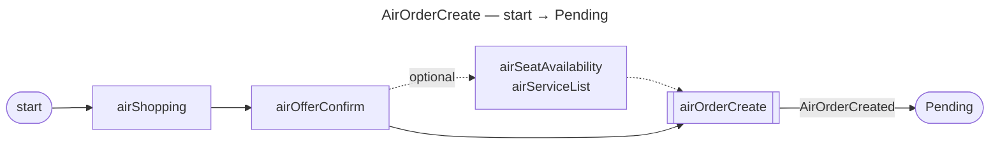

The order is created but not issued; it now sits against the airline's payment time
limit.

#### `AirOrderCreateAndIssue`

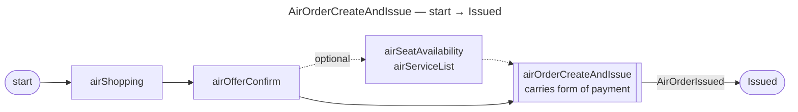

Technically the same path as `AirOrderCreate`; the terminating request carries a form of
payment, which issues the order immediately and skips `Pending` altogether.

### Issuing a pending order

#### `AirOrderIssue`

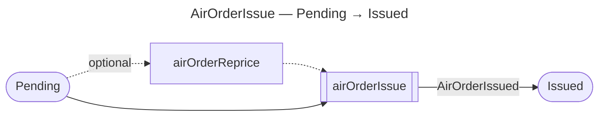

### Ending the order

#### `AirOrderCancel`

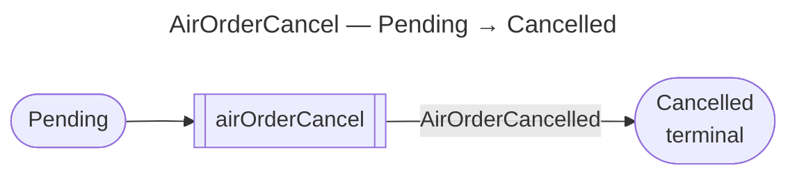

Cancellation applies to an order that was never issued. An issued order is ended by
`AirOrderVoid` or `AirOrderRefund`, never by `AirOrderCancel`.

#### `AirOrderVoid`

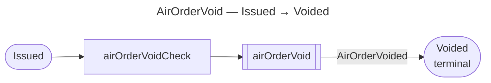

Both requests are required: if `airOrderVoidCheck` does not clear, the workflow does not
complete and the order stays `Issued`.

#### `AirOrderRefund`

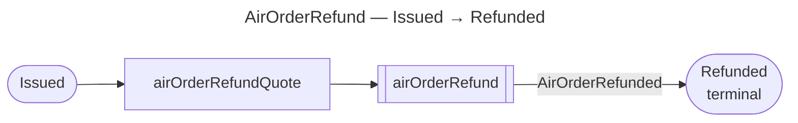

### Rebooking

#### `AirOrderRebook`

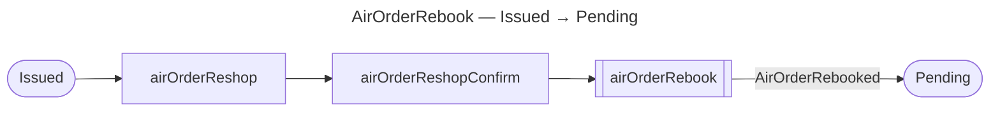

Rebooking without payment sends the order **backwards** to `Pending`, where it is subject
to a payment time limit again and must be issued by `AirOrderIssue`.

#### `AirOrderRebookAndIssue`

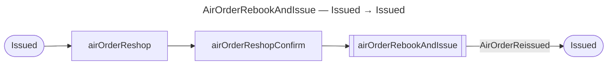

Same first two requests as `AirOrderRebook`; the terminating request reissues in place,
so the order never leaves `Issued` and the event is `AirOrderReissued`, not
`AirOrderRebooked`.

### Structural

#### `AirOrderSplit`

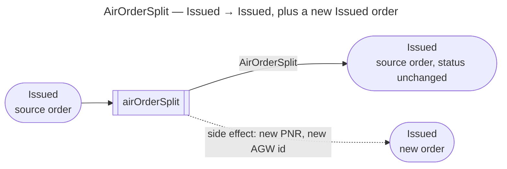

The dashed edge is the one thing a pure state diagram cannot express: the split creates a
**second order**, already `Issued`. The source order's own status does not move, which is
why the canonical transition is a self-transition on `Issued`.

### Servicing

Four workflows that change what the order contains without changing its status. Each
still emits exactly one event.

#### `AirOrderAddServices`

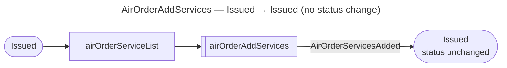

#### `AirOrderAddSeats`

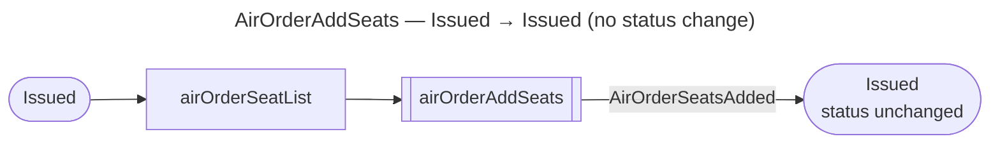

#### `AirOrderRemoveServices`

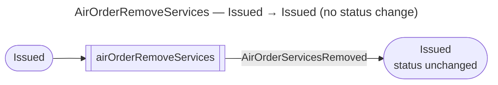

#### `AirOrderRemoveSeats`

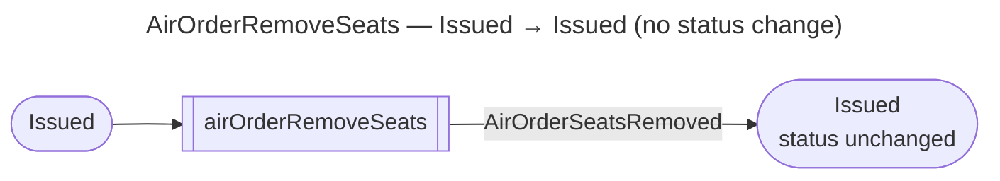

Removal needs no listing request: what is already on the order is known.

### Detection — not workflows

Nothing below is invoked as a workflow. Every transition here is **discovered** by an
`airOrderRetrieve` against the airline (Rule 8), so `airOrderRetrieve` is drawn as the
request in each of them.

#### `airOrderRetrieve` against a `Pending` order

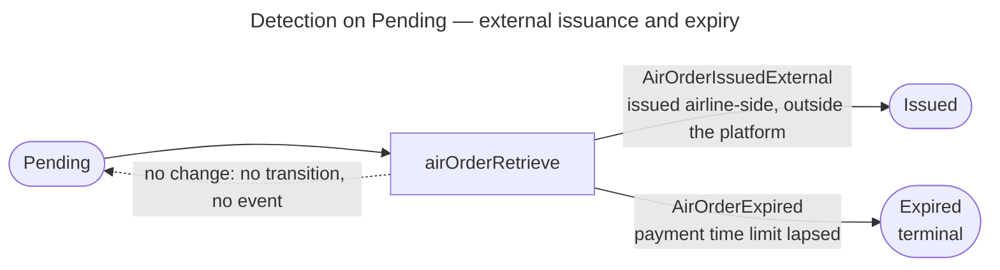

`AirOrderIssueExternal` is the PascalCase name of the top transition. It is a *named
detection transition*, never a workflow — nobody calls it; it exists so Rule 8 has an
explicit `(Pending, Issued)` row. Only `Pending` can expire.

#### `airOrderRetrieve` against an `Issued` order — flown states

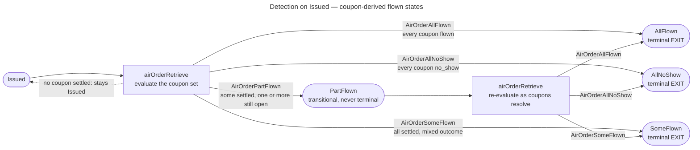

The three EXIT statuses are valid only when **every** coupon has settled. `PartFlown` is
the shape of "not yet": it is re-evaluated on each `airOrderRetrieve` and always ends on
one of the three.

#### `airOrderRetrieve` reporting `Blocked` or `Unknown`

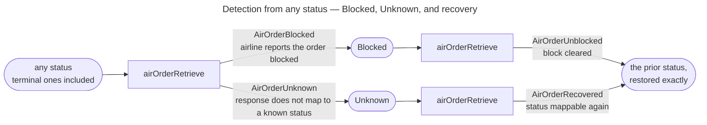

Both statuses are universal and non-terminal: either can stem from a temporary error, so
the prior status MUST be persisted on entry and is the only status recovery may restore.

### Inbound

#### `airOrderChangeNotif`

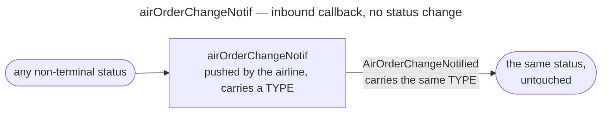

The only trigger in the platform that emits an event without touching the state machine.
Its `TYPE` enum is below.

## States

There are exactly **12** canonical statuses. No others are valid.

The three coupon-derived EXIT statuses (`AllFlown`, `SomeFlown`, `AllNoShow`) are
valid **only** when every coupon has reached a dead end (`flown` or `no_show`) — that
coupon-level validation is what makes them terminal.

| State | Kind | Meaning |
|---|---|---|
| `Pending` | Entry / active | Order created but not yet issued. Awaiting ticketing/payment within the time limit. |
| `Issued` | Active | Order issued and held by the airline. The main operational state and central hub. |
| `Cancelled` | Terminal | Order cancelled before issuance via `AirOrderCancel`. |
| `Expired` | Terminal | Payment time limit lapsed while `Pending`. Time-driven, airline-side; surfaced via `airOrderRetrieve`. |
| `Voided` | Terminal | Issued order voided via `AirOrderVoid`. |
| `Refunded` | Terminal | Issued order refunded via `AirOrderRefund`. |
| `AllFlown` | Terminal (EXIT) | Every coupon resolved to `flown`. Derived, terminal. |
| `SomeFlown` | Terminal (EXIT) | Every coupon settled, with a **mixed** outcome (some `flown`, some `no_show`). Derived, terminal. |
| `AllNoShow` | Terminal (EXIT) | Every coupon resolved to `no_show`. Derived, terminal. |
| `PartFlown` | Transitional (never terminal) | **Some** coupons are on a dead-end status, at least one is still open. Temporary by definition; re-evaluated on every `airOrderRetrieve` and eventually advances to `AllFlown`, `SomeFlown`, or `AllNoShow`. |
| `Blocked` | Exceptional (non-terminal) | Airline reports the order as blocked. Reachable from **any** state via `airOrderRetrieve`. May stem from a temporary error, so a later `airOrderRetrieve` may return the order to the state it held before. |
| `Unknown` | Exceptional (non-terminal) | Airline response does not map to a known state. Reachable from **any** state via `airOrderRetrieve`. May stem from a temporary error, so a later `airOrderRetrieve` may return the order to the state it held before. |

## Workflows → Transitions → Events

The authoritative contract. Each row binds a **trigger** to a **transition** and the
**event** it emits. The **Direction** column distinguishes the three kinds of trigger:
*outbound* (workflows we invoke against the airline), *detection* (airline-side
outcomes surfaced via `airOrderRetrieve` — **every** detection transition is discovered by an `airOrderRetrieve`, not only `Blocked`/`Unknown`), and *inbound* (callbacks the airline pushes to us).

| Workflow / trigger | Direction | From → To | Emitted event |
|---|---|---|---|
| `AirOrderCreate` | outbound | start → `Pending` | `AirOrderCreated` |
| `AirOrderCreateAndIssue` | outbound | start → `Issued` | `AirOrderIssued` |
| `AirOrderIssue` | outbound | `Pending` → `Issued` | `AirOrderIssued` |
| `AirOrderCancel` | outbound | `Pending` → `Cancelled` | `AirOrderCancelled` |
| `AirOrderVoid` | outbound | `Issued` → `Voided` | `AirOrderVoided` |
| `AirOrderRefund` | outbound | `Issued` → `Refunded` | `AirOrderRefunded` |
| `AirOrderRebook` | outbound | `Issued` → `Pending` | `AirOrderRebooked` |
| `AirOrderRebookAndIssue` | outbound | `Issued` → `Issued` | `AirOrderReissued` |
| `AirOrderSplit` | outbound | `Issued` → `Issued` (+ new order in `Issued`) | `AirOrderSplit` |
| `AirOrderIssueExternal` — `airOrderRetrieve` (order issued airline-side, outside the platform) | detection | `Pending` → `Issued` | `AirOrderIssuedExternal` |
| `airOrderRetrieve` (payment time limit lapsed) | detection | `Pending` → `Expired` | `AirOrderExpired` |
| `airOrderRetrieve` (all coupons flown) | detection | `Issued` → `AllFlown` | `AirOrderAllFlown` |
| `airOrderRetrieve` (some coupons settled, some still open) | detection | `Issued` → `PartFlown` | `AirOrderPartFlown` |
| `airOrderRetrieve` (all coupons settled, mixed outcome) | detection | `Issued` → `SomeFlown` | `AirOrderSomeFlown` |
| `airOrderRetrieve` (all coupons no_show, itinerary elapsed) | detection | `Issued` → `AllNoShow` | `AirOrderAllNoShow` |
| `airOrderRetrieve` (remaining coupons flown) | detection | `PartFlown` → `AllFlown` | `AirOrderAllFlown` |
| `airOrderRetrieve` (all coupons settled, mixed outcome) | detection | `PartFlown` → `SomeFlown` | `AirOrderSomeFlown` |
| `airOrderRetrieve` (remaining coupons no_show) | detection | `PartFlown` → `AllNoShow` | `AirOrderAllNoShow` |
| `airOrderRetrieve` (airline reports blocked) | detection | *any* → `Blocked` | `AirOrderBlocked` |
| `airOrderRetrieve` (response unmappable) | detection | *any* → `Unknown` | `AirOrderUnknown` |
| `airOrderRetrieve` (block cleared / temporary error resolved) | detection | `Blocked` → *prior state* | `AirOrderUnblocked` |
| `airOrderRetrieve` (state mappable again / temporary error resolved) | detection | `Unknown` → *prior state* | `AirOrderRecovered` |
| `airOrderRetrieve` (no change detected) | detection | *none — state unchanged* | *none* |
| `AirOrderAddServices` | outbound | `Issued` → `Issued` (servicing, no status change) | `AirOrderServicesAdded` |
| `AirOrderAddSeats` | outbound | `Issued` → `Issued` (servicing, no status change) | `AirOrderSeatsAdded` |
| `AirOrderRemoveServices` | outbound | `Issued` → `Issued` (servicing, no status change) | `AirOrderServicesRemoved` |
| `AirOrderRemoveSeats` | outbound | `Issued` → `Issued` (servicing, no status change) | `AirOrderSeatsRemoved` |
| `airOrderChangeNotif` | inbound (airline callback) | *none — no status change* | `AirOrderChangeNotified` (carries `TYPE`) |

Any `(from, to)` pair not in this table is **invalid** and must be rejected.

Notes on the detection rows:

- **`AirOrderIssueExternal`** is a *named detection transition*, not an outbound
  workflow: the airline issued the order outside the platform and the fact is
  surfaced by an `airOrderRetrieve`. It exists so that Rule 8 (airline state
  overrides local state) has an explicit `(Pending, Issued)` row.
- **`Blocked` → *prior state*** and **`Unknown` → *prior state*** restore the exact
  state the order held immediately before entering `Blocked`/`Unknown` (which may be
  a terminal state). The prior state MUST be preserved when entering either status.
- **A no-change `airOrderRetrieve` is a no-op.** When the retrieve confirms the
  current state, no transition occurs and no event is emitted. The table row exists
  to make this explicit; it is the common case.

## `airOrderChangeNotif` — inbound callback

`airOrderChangeNotif` is a callback the **airline sends to us**. It is strictly
associated with an order but has **no implication on order status** — it never
transitions the state machine. It may arrive while the order is in any non-terminal
state and must be treated as informational. Each notification is recorded with a
`TYPE`, and emits a single `AirOrderChangeNotified` event carrying that `TYPE`.

### `TYPE` values (canonical enum)

The notification `TYPE` is its own canonical list. `AirOrderChangeNotified` always
carries exactly one of the following values. None of them transition the state machine.

| # | TYPE |
|---|---|
| 1 | `Bereavement` |
| 2 | `ChangeByPassengerNotification` |
| 3 | `DocumentationUpdate` |
| 4 | `FakeNameClosed` |
| 5 | `FakeNameWarning` |
| 6 | `FlightBookingCancelledOutsideSchedule` |
| 7 | `FlightCancellation` |
| 8 | `FlightNumberChange` |
| 9 | `FlightTimeChange` |
| 10 | `Illness` |
| 11 | `LaborDisrupt` |
| 12 | `LoyaltyDetailsUpdate` |
| 13 | `NaturalDisaster` |
| 14 | `NeedDocumentation` |
| 15 | `NoReasonGiven` |
| 16 | `OrderDuplicated` |
| 17 | `OrderDuplicatedWarning` |
| 18 | `OrderItemAdded` |
| 19 | `OrderItemCancelled` |
| 20 | `PassengerContactDetailsChange` |
| 21 | `PassengerNameChange` |
| 22 | `PassengerNoShowNotification` |
| 23 | `PaymentTimeLimitChange` |
| 24 | `PaymentTimeLimitExpired` |
| 25 | `PermanentWithdrawal` |
| 26 | `ScheduleChange` |
| 27 | `SeatChange` |
| 28 | `SegmentDuplicatedClosed` |
| 29 | `SegmentDuplicatedWarning` |
| 30 | `ServiceStatusChange` |
| 31 | `Strike` |
| 32 | `UnacceptableReaccommodation` |
| 33 | `UnknownNotification` |
| 34 | `Voluntary` |
| 35 | `Weather` |

> 35 canonical values. `airOrderChangeNotif` remains informational-only — even types
> that *sound* status-changing (e.g. `FlightCancellation`, `PaymentTimeLimitExpired`)
> do **not** move the state machine. Any actual status change is discovered separately
> via `airOrderRetrieve` (detection). Use `UnknownNotification` as the fallback for
> unmapped values.

## `AirOrderSplit` — structural operation

`AirOrderSplit` divides one order's passengers into two: the original order **stays
`Issued`**, and a **new order** (new PNR, new ID) is created directly in
`Issued`. It is modelled as a self-transition on `Issued` because it does not
change the source order's status; the side effect is the creation of a second
`Issued` order. Pure state-diagram syntax cannot express the spawned order — the
`AirOrderSplit` diagram draws it as a dashed side-effect edge — hence this note is
normative.

## Coupon model (scope: flown-state derivation only)

> **Scope.** Coupons appear in this document for **one purpose only**: to derive the
> four flown-related order states (`AllFlown`, `SomeFlown`, `AllNoShow`,
> `PartFlown`). They are **not** part of any workflow, event, or transition elsewhere,
> and no other layer logic should key off coupons.
>
> **Naming note.** The coupon-level status keeps the name `no_show`; only the
> *order*-level state is called `AllNoShow` (all coupons `no_show`).

A booking has **multiple coupons** — conceptually one per passenger per segment. Each
coupon resolves independently to a final value:

| Coupon status | Meaning |
|---|---|
| `flown` | The passenger flew that segment. |
| `no_show` | The passenger did not fly that segment. |

(A coupon may also be *open* — not yet resolved to either final value.)

### Aggregation rule (order flown-state)

The order's flown state is a pure function of its coupon set, evaluated on each
`airOrderRetrieve`:

| Coupon set | Order state | Terminal? |
|---|---|---|
| Every coupon `flown` | `AllFlown` | Yes — EXIT status |
| Every coupon `no_show` | `AllNoShow` | Yes — EXIT status |
| Every coupon settled (`flown`/`no_show`), **mixed** outcome | `SomeFlown` | Yes — EXIT status |
| **Some** coupons settled, at least one still **open** | `PartFlown` | No — transitional; re-evaluate on next `airOrderRetrieve` |
| No coupon settled yet | stays `Issued` | — (no flown-state derivation applies) |

**The only legitimate dead end is when all coupons are in a final state** — that is
what validates the three EXIT statuses (`AllFlown`, `SomeFlown`, `AllNoShow`).
`PartFlown` is **never** terminal: it exists precisely because at least one coupon is
still open, and it advances to one of the three EXIT statuses as the remaining coupons
resolve.

## Rules

1. **Two entry points only.** An order begins at `Pending` (`AirOrderCreate`) or
   `Issued` (`AirOrderCreateAndIssue`). Nothing else creates an order.
2. **Terminal states are final.** `Cancelled`, `Expired`, `Voided`, `Refunded`,
   `AllFlown`, `SomeFlown`, `AllNoShow` end the lifecycle unconditionally.
   `PartFlown` is **never** terminal (see Rule 5 and the Coupon model). The only thing
   that may follow a terminal state is `Blocked` or `Unknown`, and only as reported by
   `airOrderRetrieve` — and from there the only way forward is back to that same
   terminal state (Rule 3).
3. **`Blocked` and `Unknown` are universal and non-terminal.** Reachable from every
   state (including terminal ones) via `airOrderRetrieve`. Both can stem from a
   **temporary error**, so neither is terminal: a later `airOrderRetrieve` may return
   the order to the exact state it held before entering them (emitting
   `AirOrderUnblocked` / `AirOrderRecovered`). The prior state MUST therefore be
   preserved on entry. The detection diagram draws these edges from a single
   *any status* node; the transition table is normative.
4. **`Expired` is time-driven, discovered by `airOrderRetrieve`.** It results from the
   payment time limit lapsing airline-side, not from a client operation; the lapse is
   *surfaced* to us via `airOrderRetrieve`. Only `Pending` can expire.
5. **Flown states are coupon-derived.** `AllFlown`, `SomeFlown`, `AllNoShow`, and
   `PartFlown` are post-travel outcomes of an `Issued` order, detected via
   `airOrderRetrieve` — never triggered by an agent workflow. They are **aggregations
   over the order's coupons** (see the Coupon model): `AllFlown` = all coupons
   `flown`; `AllNoShow` = all coupons `no_show`; `SomeFlown` = all coupons settled
   with a mixed outcome; `PartFlown` = some coupons settled, at least one still open.
   The first three are EXIT statuses, valid **only when every coupon is in a final
   state** (`flown` or `no_show`); `PartFlown` is transitional and advances to one of
   them as the remaining coupons resolve.
6. **Rebook returns to `Pending`.** `AirOrderRebook` moves an `Issued` order back to
   `Pending`; `AirOrderRebookAndIssue` keeps it `Issued` and emits `AirOrderReissued`.
7. **`airOrderChangeNotif` never transitions state.** It is inbound, informational,
   and associated to the order; it only emits `AirOrderChangeNotified` with a `TYPE`.
8. **`airOrderRetrieve` is the mechanism for *every* detection transition.** All
   airline-sourced outcomes — external issuance (`AirOrderIssueExternal`), `Expired`,
   `AllFlown`, `SomeFlown`, `AllNoShow`, `PartFlown`, `Blocked`, `Unknown`, and
   `Blocked`/`Unknown` recovery — are discovered by an `airOrderRetrieve`, never by
   invoking a workflow. Airline state reported by `airOrderRetrieve` overrides local
   state when it maps to a known state; every such override corresponds to a detection
   row in the table.
9. **A no-change `airOrderRetrieve` is a no-op.** When the retrieve confirms the
   order's current state, it drives no transition and emits no event.

## API Requester — provider-specific layer

Everything above this line is the **canonical layer**: states, workflows, and events.
It is **provider-agnostic** and never varies. This section defines the layer *below*
it, the **API Requester**, where each provider (airline) supplies the concrete request
sequence that fulfils a workflow.

### The binding rule

A canonical workflow maps to **one or more** provider requests in the API Requester
(normally between one and three). No matter how many requests it fans out into:

1. The workflow emits **exactly one** canonical event and drives **exactly one** state
   transition, as defined in the contract table above.
2. The transition is **atomic and commit-on-success only.** The state machine moves
   **only** when the workflow completes fully across all its provider requests. Any
   incomplete or failed sequence means **no state change** — the order stays exactly
   where it was. Retries, rollback, and partial-failure handling live entirely inside
   the API Requester and never surface as canonical states.
3. Provider adapters are **pure translations.** They may vary the *how* (number, order,
   and shape of airline requests); they may **never** invent states, events, or
   intermediate statuses, nor change which event a workflow emits.
4. **Requests are camelCase, workflows are PascalCase.** Everything named in this
   section is a *request* and is therefore camelCase; the `####` headings below name the
   *workflow* and stay PascalCase.

### Workflow ↔ request catalogue

The full mapping, in one place. `PascalCase` = canonical workflow, `camelCase` =
API Requester request. Every workflow's **last** request is its own name in camelCase —
that is the naming rule, and the case is the only thing distinguishing the two.

| Workflow (PascalCase) | Request sequence (camelCase) | Terminating request | Emitted event |
|---|---|---|---|
| `AirOrderCreate` | `airShopping` → `airOfferConfirm` → *(opt. `airSeatAvailability`, `airServiceList`)* → `airOrderCreate` | `airOrderCreate` | `AirOrderCreated` |
| `AirOrderCreateAndIssue` | `airShopping` → `airOfferConfirm` → *(opt. `airSeatAvailability`, `airServiceList`)* → `airOrderCreateAndIssue` | `airOrderCreateAndIssue` | `AirOrderIssued` |
| `AirOrderIssue` | *(opt. `airOrderReprice`)* → `airOrderIssue` | `airOrderIssue` | `AirOrderIssued` |
| `AirOrderCancel` | `airOrderCancel` | `airOrderCancel` | `AirOrderCancelled` |
| `AirOrderVoid` | `airOrderVoidCheck` → `airOrderVoid` | `airOrderVoid` | `AirOrderVoided` |
| `AirOrderRefund` | `airOrderRefundQuote` → `airOrderRefund` | `airOrderRefund` | `AirOrderRefunded` |
| `AirOrderRebook` | `airOrderReshop` → `airOrderReshopConfirm` → `airOrderRebook` | `airOrderRebook` | `AirOrderRebooked` |
| `AirOrderRebookAndIssue` | `airOrderReshop` → `airOrderReshopConfirm` → `airOrderRebookAndIssue` | `airOrderRebookAndIssue` | `AirOrderReissued` |
| `AirOrderSplit` | `airOrderSplit` | `airOrderSplit` | `AirOrderSplit` |
| `AirOrderAddServices` | `airOrderServiceList` → `airOrderAddServices` | `airOrderAddServices` | `AirOrderServicesAdded` |
| `AirOrderAddSeats` | `airOrderSeatList` → `airOrderAddSeats` | `airOrderAddSeats` | `AirOrderSeatsAdded` |
| `AirOrderRemoveServices` | `airOrderRemoveServices` | `airOrderRemoveServices` | `AirOrderServicesRemoved` |
| `AirOrderRemoveSeats` | `airOrderRemoveSeats` | `airOrderRemoveSeats` | `AirOrderSeatsRemoved` |

Detection and inbound triggers are **not workflows** and have no request sequence of
their own:

| Trigger | Kind | Case | Emitted event(s) |
|---|---|---|---|
| `airOrderRetrieve` | Detection request | camelCase | `AirOrderExpired`, `AirOrderIssuedExternal`, `AirOrderAllFlown`, `AirOrderPartFlown`, `AirOrderSomeFlown`, `AirOrderAllNoShow`, `AirOrderBlocked`, `AirOrderUnknown`, `AirOrderUnblocked`, `AirOrderRecovered` |
| `airOrderChangeNotif` | Inbound callback | camelCase | `AirOrderChangeNotified` |
| `AirOrderIssueExternal` | Named detection transition (canonical, never called) | PascalCase | `AirOrderIssuedExternal` |

Request-only names that never terminate a workflow, and so never have a PascalCase
counterpart: `airShopping`, `airOfferConfirm`, `airSeatAvailability`, `airServiceList`,
`airOrderReprice`, `airOrderVoidCheck`, `airOrderReshop`, `airOrderReshopConfirm`,
`airOrderRefundQuote`, `airOrderServiceList`, `airOrderSeatList`, `airOrderRetrieve`,
`airOrderChangeNotif`.

### Provider adapter matrix (template)

For each `(workflow, provider)` pair, declare the request sequence. Fill one table per
workflow that actually varies by provider; workflows that are identical everywhere need
no entry.

#### `AirOrderCreate` (example)

Minimal ("fastest") happy-path implementation. Additional optional requests exist and
may be inserted, but the minimal sequence is three requests:

| Provider | Request sequence | Success condition | Emits |
|---|---|---|---|
| `PROVIDER_TEMPLATE` | 1. `airShopping` → 2. `airOfferConfirm` → *(optional: `airSeatAvailability`, `airServiceList`)* → 3. `airOrderCreate` | step 3 returns OK | `AirOrderCreated` |

> All rows collapse to the same canonical transition (`start → pending`) and the same
> event (`AirOrderCreated`). Optional requests may extend the sequence, but the success
> condition remains the final `airOrderCreate` returning OK, and an incomplete sequence
> means **no order is created** (no state change).

#### `AirOrderCreateAndIssue` (example)

Technically the **same path** as `AirOrderCreate`. The only difference is the final
request: it includes a **form of payment**, which issues the order immediately and
lands it directly in `Issued` rather than `Pending`.

| Provider | Request sequence | Success condition | Emits |
|---|---|---|---|
| `PROVIDER_TEMPLATE` | 1. `airShopping` → 2. `airOfferConfirm` → *(optional: `airSeatAvailability`, `airServiceList`)* → 3. `airOrderCreateAndIssue` (with form of payment) | step 3 returns OK | `AirOrderIssued` |

> Same shopping/offer steps as `AirOrderCreate`; the final request differs by carrying a
> form of payment. Collapses to the canonical transition `start → issued` and the
> event `AirOrderIssued`. An incomplete sequence means no order is created (no state change).

#### `AirOrderIssue` (example)

Issues an unissued (`Pending`) order, moving it to `Issued`. Two steps, the first
of which is optional:

| Provider | Request sequence | Success condition | Emits |
|---|---|---|---|
| `PROVIDER_TEMPLATE` | *(optional: 1. `airOrderReprice`)* → 2. `airOrderIssue` | `airOrderIssue` returns OK | `AirOrderIssued` |

> Collapses to the canonical transition `pending → issued` and the event
> `AirOrderIssued`. `airOrderReprice` is optional; an incomplete sequence means the order
> stays `Pending` (no state change).

#### `AirOrderVoid` (example)

Two required steps:

| Provider | Request sequence | Success condition | Emits |
|---|---|---|---|
| `PROVIDER_TEMPLATE` | 1. `airOrderVoidCheck` → 2. `airOrderVoid` | `airOrderVoid` returns OK | `AirOrderVoided` |

> Collapses to the canonical transition `issued → voided` and the event `AirOrderVoided`.
> Both steps required; an incomplete sequence means no state change (order stays `Issued`).

#### `AirOrderRebook` (example)

Three required steps (named after its last request, per the naming rule):

| Provider | Request sequence | Success condition | Emits |
|---|---|---|---|
| `PROVIDER_TEMPLATE` | 1. `airOrderReshop` → 2. `airOrderReshopConfirm` → 3. `airOrderRebook` | `airOrderRebook` returns OK | `AirOrderRebooked` |

> Collapses to the canonical transition `issued → pending` and the event
> `AirOrderRebooked`. All three steps required; an incomplete sequence means no state change
> (order stays `Issued`).

#### `AirOrderAddServices` (example)

Servicing operation on an already-issued order. **No state implication** — the order is
`Issued` and remains `Issued`. Two requests:

| Provider | Request sequence | Success condition | Emits |
|---|---|---|---|
| `PROVIDER_TEMPLATE` | 1. `airOrderServiceList` → 2. `airOrderAddServices` | `airOrderAddServices` returns OK | `AirOrderServicesAdded` |

> Self-transition on `Issued` (no status change); emits `AirOrderServicesAdded`. An
> incomplete sequence means no services are added (and, as always, no state change).

#### `AirOrderAddSeats` (example)

Same shape as `AirOrderAddServices`, for seats. **No state implication** — order is
`Issued` and remains `Issued`. Two requests:

| Provider | Request sequence | Success condition | Emits |
|---|---|---|---|
| `PROVIDER_TEMPLATE` | 1. `airOrderSeatList` → 2. `airOrderAddSeats` | `airOrderAddSeats` returns OK | `AirOrderSeatsAdded` |

> Self-transition on `Issued` (no status change); emits `AirOrderSeatsAdded`. An
> incomplete sequence means no seats are added (no state change).

#### `AirOrderRemoveServices` (example)

Remove counterpart of `AirOrderAddServices`. **No state implication** — stays `Issued`.

| Provider | Request sequence | Success condition | Emits |
|---|---|---|---|
| `PROVIDER_TEMPLATE` | 1. `airOrderRemoveServices` (single request) | `airOrderRemoveServices` returns OK | `AirOrderServicesRemoved` |

> Self-transition on `Issued` (no status change); emits `AirOrderServicesRemoved`.

#### `AirOrderRemoveSeats` (example)

Remove counterpart of `AirOrderAddSeats`. **No state implication** — stays `Issued`.

| Provider | Request sequence | Success condition | Emits |
|---|---|---|---|
| `PROVIDER_TEMPLATE` | 1. `airOrderRemoveSeats` (single request) | `airOrderRemoveSeats` returns OK | `AirOrderSeatsRemoved` |

> Self-transition on `Issued` (no status change); emits `AirOrderSeatsRemoved`.

#### `AirOrderSplit` (example)

Single-request workflow (the request is the workflow name in camelCase, per the naming
rule). See the
structural note below — the source order stays `Issued` and a **new** `Issued`
order is spawned.

| Provider | Request sequence | Success condition | Emits |
|---|---|---|---|
| `PROVIDER_TEMPLATE` | 1. `airOrderSplit` (single request) | `airOrderSplit` returns OK | `AirOrderSplit` |

> Self-transition on `Issued` for the source order, plus creation of a new order
> directly in `Issued`. An incomplete request means no split and no state change.

#### `AirOrderCancel` (example)

Single-request workflow; only valid on a `Pending` order.

| Provider | Request sequence | Success condition | Emits |
|---|---|---|---|
| `PROVIDER_TEMPLATE` | 1. `airOrderCancel` (single request) | `airOrderCancel` returns OK | `AirOrderCancelled` |

> Collapses to the canonical transition `pending → cancelled`. An incomplete request
> means no state change (order stays `Pending`).

#### `AirOrderRebookAndIssue` (example)

Same path as `AirOrderRebook`, but the final request issues the order — landing it in
`Issued` instead of `Pending`.

| Provider | Request sequence | Success condition | Emits |
|---|---|---|---|
| `PROVIDER_TEMPLATE` | 1. `airOrderReshop` → 2. `airOrderReshopConfirm` → 3. `airOrderRebookAndIssue` | `airOrderRebookAndIssue` returns OK | `AirOrderReissued` |

> Collapses to the canonical transition `issued → issued`; emits `AirOrderReissued`.
> Same reshop/offer-confirm steps as `AirOrderRebook`; only the final request differs.

#### `AirOrderRefund` (example)

Two required steps (workflow named after its last request, per the naming rule):

| Provider | Request sequence | Success condition | Emits |
|---|---|---|---|
| `PROVIDER_TEMPLATE` | 1. `airOrderRefundQuote` → 2. `airOrderRefund` | `airOrderRefund` returns OK | `AirOrderRefunded` |

> Collapses to the canonical transition `issued → refunded` and the event
> `AirOrderRefunded`. Both steps required; an incomplete sequence means no state change
> (order stays `Issued`).

Replace `PROVIDER_TEMPLATE` and the request names with real values as you onboard each
airline. Keep the last two columns invariant across rows — they are dictated by the
canonical contract, not by the provider.

### Layered view (canonical vs API Requester)

This diagram shows the two-layer contract at a glance: one canonical workflow up top,
fanning out into per-provider request sequences in the API Requester below, all
collapsing back into a single transition and a single event.

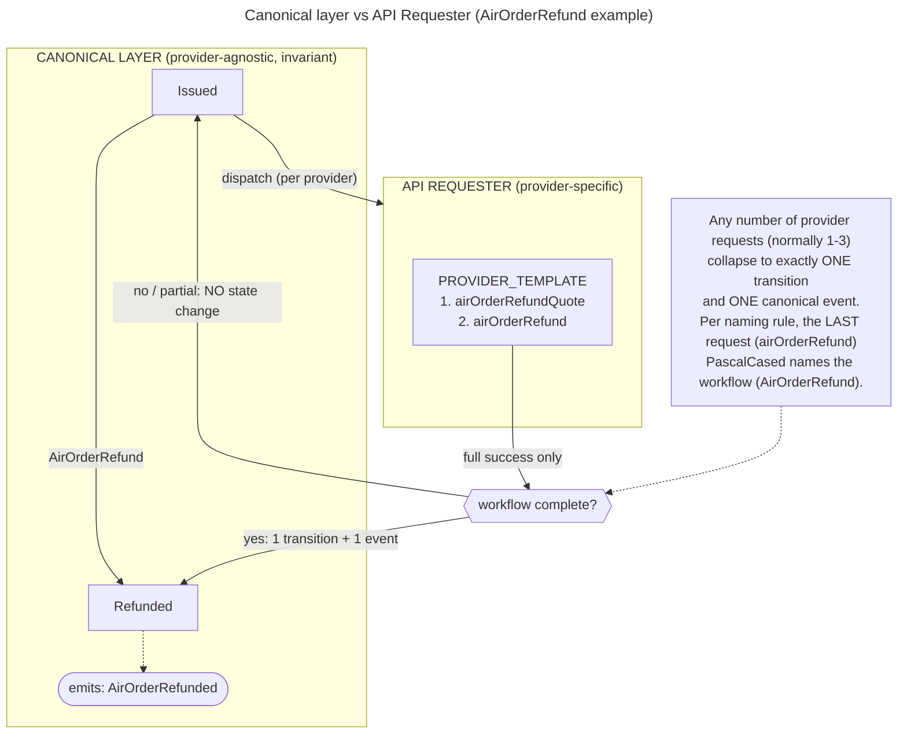

## Layer contract

- **Persistence.** Store status as an enum whose values exactly match the 12 state
  names above. Never store display labels. Additionally, persist the **prior state**
  whenever an order enters `Blocked` or `Unknown`, so recovery can restore it.
- **Controller / service.** Perform transitions only via the table above. Guard every
  status write against it; reject unlisted `(from, to)` pairs rather than coercing them.
- **API.** Serialize state, workflow, request, and event names as these exact strings,
  **case included**: workflows PascalCase, requests camelCase. Downstream consumers
  depend on the pair being canonical, and case is load-bearing — `AirOrderCreate` and
  `airOrderCreate` are different things and MUST NOT be normalised into one another.
- **Front end.** Map state names to display labels; never hardcode alternates and never
  invent intermediate/cosmetic statuses. Render derived views (e.g. "actionable",
  "closed") as presentation groupings over the 12 states. Treat `AirOrderChangeNotified`
  as informational, not a status change.
- **Tests.** Cover both entry points, every listed transition, terminal-state finality,
  `Blocked`/`Unknown` arriving from a terminal state **and recovering back to it**
  (prior-state restoration, including from non-terminal states), external issuance
  (`AirOrderIssueExternal`: `Pending` → `Issued` by detection), the no-op retrieve
  (no transition, no event), and that `airOrderChangeNotif` leaves status untouched.
  For flown states, cover the coupon aggregation rule explicitly: `AllFlown` (all
  coupons flown), `AllNoShow` (all no_show), `SomeFlown` (all settled, mixed
  outcome), and transitional `PartFlown` (some settled, some open) advancing on
  re-`airOrderRetrieve` to each of the three EXIT statuses — plus that `PartFlown`
  is never accepted as a final state.

## Changes

Update this file in the **same change** that alters platform behaviour, never after.
Any logic that contradicts this state machine requires a mandatory update here first.
This file is the sole authority; the former skill `agw-v2-order-status-lifecycle` is
retired and must not be reintroduced as a parallel source.
