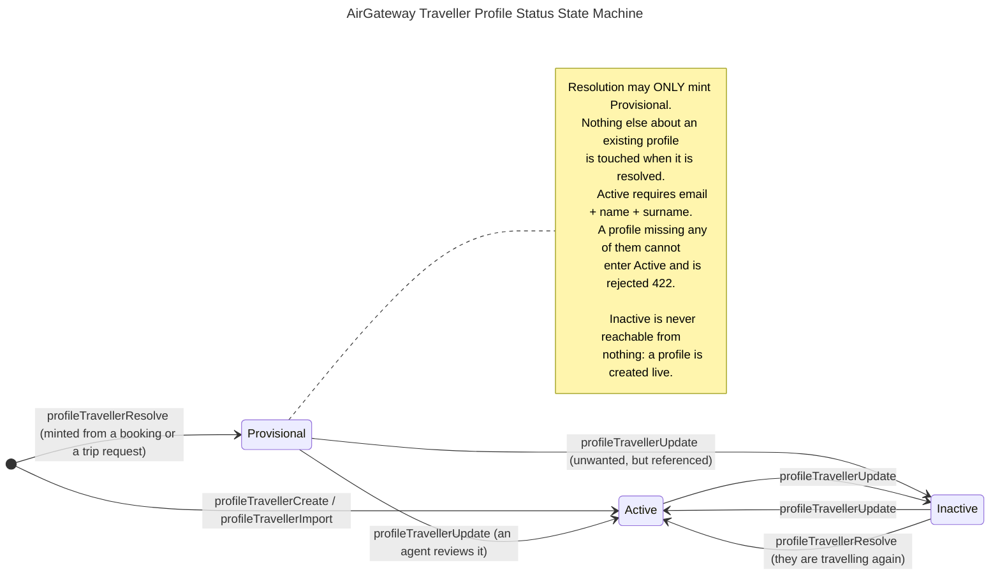

# Profiles — Travellers and Companies — Single Source of Truth

> **Canonical spec — single source of truth.** This document is *the* authoritative
> definition of the **Traveller** and **Company** profile items: what each one is, the
> **statuses** they may hold, the **associations** between them and the rest of the
> platform, and the **validations** every layer MUST apply. All layers — hub
> persistence, AGW API V2, BookingPad, the traveller app — MUST conform to the exact
> names, states and rules defined here. Do not invent fields, statuses or associations
> without updating this file via PR.
>
> If any code, doc, or skill contradicts this file, this file wins and the other must
> be corrected.

## What a profile is, and what it is not

A profile is **the agency's own record of a person, or of the organisation that person
travels for**. It is a roster the agency curates. It is *not* a booking, not a copy of
one, and not derived from one.

This is the rule everything below follows from, and it has a sharp edge:

- **A booking is a snapshot; a profile is the source.** An order carries whatever
  spelling of a name, whichever document and whichever address were sent to the airline
  on the day. That is evidence of what was booked and must never be rewritten. The
  profile is what the agency believes is *currently* true about the person, and it is
  edited freely.
- **A booking may never silently rewrite a profile.** Resolution by email finds a person
  and, when nobody holds that address, creates one — but an existing profile is returned
  **untouched**. Resolving is not a back door for overwriting a roster the agency
  maintains.
- **A profile may never silently rewrite a booking.** Correcting a passport number on a
  profile does not reach into an issued order. Changing what an airline holds is an
  order servicing workflow in [ORDER-STATE-MACHINE.md](ORDER-STATE-MACHINE.md).

The two are linked, not merged: `order_passengers.traveler_id` points from the snapshot
back to the source, which is what makes "show me this person's trips" answerable at all.

### A traveller is identified by their email address

Not by name — names are shared, misspelled, transliterated, and returned by airlines in
forms nobody typed. **Email is the identity**, and it is what every entry point keys on:
`Ag-Traveller` names a traveller by address, booking links resolve a passenger by
address, and a proposal names its subject by the traveller that address resolved to.

Two consequences are normative:

- **An address is unique within a company**, case-insensitively. This is what makes it
  usable as an identifier at all.
- **It is unique within a company, not within an agency.** An agency serving several
  corporates may legitimately hold two different people behind one address. Resolving
  such an address across an agency is a **`409`**, never a guess — picking one attaches
  somebody else's trips to this person.

## Naming conventions

- **The API spells it `traveller`; the database spells it `traveler`.** British on every
  wire format and in every API field name, US in every database identifier, to match
  `public.travelers` and `bookings.order_passengers.traveler_id`. The boundary is the
  repository layer. This is deliberate, it is already the rule in hub, and it is not to
  be "fixed" in either direction.
- **Statuses** — PascalCase (`Active`, `Provisional`). Stored values MUST match exactly;
  display labels may differ, stored values may not.
- **Operations** — camelCase `operationId` matching AGW API V2 (`profileTravellerCreate`),
  PascalCase summary (`ProfileTravellerCreate`). As with proposals there is **no
  PascalCase workflow layer**: nothing here dispatches to a provider, so a profile
  operation is one action in one call.
- **API field names are camelCase** (`companyId`, `travellerCode`), matching the rest of
  AGW API V2. Hub's own `/agw`, `/agent` and `/admin` surfaces use snake_case; the
  translation is AGW API V2's job.

### The namespace sits outside `air`

Profiles live under **`/v2/profiles`** — `/v2/profiles/travellers` and
`/v2/profiles/companies` — not under `/v2/air`. A profile is not an NDC concept, no
airline is involved in creating one, and none of these operations touch a provider.

`profiles` is not a new word for the platform to learn: BookingPad already calls the
section Profiles with Company and Traveller tabs, hub's RBAC already carries
`profile_traveler`, `profile_corporate` and `pms.profiles`, and hub's domain already has
`ProfileRoleTraveler` and `ProfileDocument`.

## The two items

### Traveller

A person the agency books for. Belongs to exactly one company.

| Field | Type | Required | Notes |
|---|---|---|---|
| `id` | UUID | issued | Platform-issued, stable forever. See [IDS.md](IDS.md) — an *issued* id, not a provider handle; nothing to mint. |
| `companyId` | UUID | **yes** | The company whose roster this person is on. Immutable in spirit, movable in fact — see *Reparenting* below. |
| `status` | enum | **yes** | One of the three below. |
| `email` | email | **yes** on create | The identity. Unique per company, case-insensitive. |
| `name` | string(255) | for `Active` | Given name. |
| `surname` | string(255) | for `Active` | Family name. |
| `title` | string(255) | no | `MR`, `MRS`, `MS`, `DR`… Uppercase, not enumerated — passed through to the airline. |
| `gender` | enum | no | See *Vocabularies inherited from the Air surface*. |
| `birthdate` | date | no | ISO 8601 `YYYY-MM-DD`. No time, no zone — a date of birth is not an instant. |
| `documents[]` | Document | no | Identity documents. Shape is normative below. |
| `phoneCountryCode` | string(10) | no | ISO 3166-1 alpha-2, uppercase. |
| `phoneCode` | string(20) | no | Dialling code, digits only, no `+`. |
| `phoneNumber` | string(255) | no | National number, digits only. |
| `addressCountryCode` | string(10) | no | ISO 3166-1 alpha-2, uppercase. |
| `addressPostalCode` | string(255) | no | |
| `addressCityName` | string(255) | no | |
| `addressStreet` | string(255) | no | |
| `frequentFlyerNumbers[]` | FrequentFlyer | no | Shape is normative below. |
| `travellerCode` | string | no | The agency's or corporate's own code for this person. Unique per company where present. |
| `homebase` | string(3) | no | IATA airport or city code, uppercase. The person's home departure point. |
| `proposalCount` | integer | **derived**, read-only | How many proposals name this traveller. Not a column: computed alongside the row on the agency-scoped reads (`GET /agw/travellers`, `GET /agw/travellers/{id}?agency_id=`), zero elsewhere. A traveller named on any proposal cannot be deleted (`RESTRICT`), so a client says so before trying — see *Deletion*. |
| `createdAt` / `updatedAt` | timestamp | issued | Server-set. |

**Document** — the shape is **exactly the booking passenger document**, field for field,
because a profile document exists to become one:

| Field | Notes |
|---|---|
| `type` | Document kind. Vocabulary inherited from the Air surface — see below. |
| `id` | The document number as printed. |
| `expirationDate` | ISO 8601 `YYYY-MM-DD`. Widened to a datetime at the Air boundary, which is where that representation belongs. |
| `issuingCountryCode` | ISO 3166-1 alpha-2, uppercase. |
| `citizenshipCountryCode` | ISO 3166-1 alpha-2, uppercase. |
| `residenceCountryCode` | ISO 3166-1 alpha-2, uppercase. |
| `fiscalName` | Name as printed on the document, where it differs from `name`/`surname`. |

There is no `nationality` field. **Nationality is `documents[].citizenshipCountryCode`
on the primary document**, and anything displaying "nationality" derives it there rather
than storing a second, divergent copy.

**FrequentFlyer** — `airlineCode` (IATA, 2 characters, uppercase) plus `number`. **Not
an alliance.** A frequent-flyer account belongs to one carrier's programme and a booking
must name that carrier; an alliance cannot be sent to an airline. See *Known
non-conformance*.

### Company

The organisation a traveller travels for — a corporate account of the agency. Every
traveller has one; there is no such thing as a company-less profile.

| Field | Type | Required | Notes |
|---|---|---|---|
| `id` | UUID | issued | Platform-issued, stable forever. |
| `agencyId` | UUID | **yes** | The owning agency. The root of tenancy for everything below it. |
| `consumerId` | UUID | **yes** | The tenant the agency belongs to. |
| `status` | enum | **yes** | `Active` or `Inactive`. |
| `name` | string(255) | **yes** | Non-empty. |
| `accountNumber` | string(255) | no | The corporate's account reference. Surfaced in BookingPad as the GDS account id. |
| `domains[]` | hostname | no | Email domains belonging to this company. Lowercase. **Unique across all companies** — a domain identifies exactly one. |
| `discountCodes` | map | no | Negotiated codes, keyed by airline. |
| `loyaltyProgramDiscountCodes` | map | no | As above, for loyalty programmes. |
| `customFields` | map | no | Agency-defined key/value pairs. |
| `travellerCount` | integer | **derived**, read-only | How many travellers are on this company's roster. Not a column: computed alongside the row on the agency-scoped reads, zero elsewhere. A company still holding travellers cannot be deleted (`RESTRICT`), so a client says so before trying — see *Deletion*. Shipped in [hub#42](https://github.com/AirGateway/hub-api-v2/pull/42). |
| `createdAt` / `updatedAt` | timestamp | issued | Server-set. |

Remarks are **not** a company field. They are definitions in `public.remarks` attached
through `public.company_remarks`; the legacy `companies.remarks` array is deprecated and
MUST NOT be read or written by any new code.

## The 3 traveller statuses

**These three are the complete set.** A traveller is always in exactly one of them, and
no other value may be written to `traveller.status`.

| Status | Meaning | Appears in pickers | Terminal |
|---|---|---|---|
| `Provisional` | Created by the platform from a booking passenger or a proposal request, never reviewed by an agent. | yes, flagged | no |
| `Active` | A curated profile the agency stands behind. Complete enough to book. | yes | no |
| `Inactive` | Retained for history, withdrawn from everyday use. | no | no |

None is terminal. Deletion is not a status — see *Deletion*.

### Why each one exists

**`Provisional`** is the whole reason this is a status set and not a boolean.

Profiles arrive by two very different routes. An agent curates one, or a CSV roster is
imported — that is the agency asserting something. Or one is *minted by the platform*
from an order passenger or a trip request, in which case its contents are whatever a
booking payload happened to carry, which is a far worse source of truth than a roster an
agency maintains. Today those two are indistinguishable the moment they are written, and
an agency has no way to ask **"which of these did we actually check?"**

`Provisional` makes that question answerable, and it gives the answer somewhere to go:
the agency reviews the profile and it becomes `Active`.

- **Resolution may only ever create `Provisional`.** `profileTravellerResolve` and the
  booking-link path never mint an `Active` profile. This is what makes the distinction
  load-bearing rather than advisory.
- **`Provisional` is not "invalid".** The person is real and their address is real; they
  are bookable, listable and selectable. They are merely unvouched-for.

**`Active`** is a claim about completeness, not merely a flag. A profile may only be
`Active` when it carries an `email`, a `name` and a `surname` — the three fields without
which it cannot become a booking passenger. That invariant is why `Active` is worth
having: it means *this one is ready*, and a picker showing `Active` profiles is showing
things that will not fail at OrderCreate.

**`Inactive`** exists because deleting is usually the wrong answer. A person leaves the
company, and their profile still has to resolve — proposals point at it with
`ON DELETE RESTRICT`, past orders point at it, and an agency's own history is worth
more than a tidy list. `Inactive` withdraws them from pickers and default listings while
keeping every reference intact.

`Inactive` is a **display and selection** state. It does not forbid anything, and in
particular it does not block resolution: a person who books again is by definition
travelling again, so resolution finds them and **reactivates** them. The alternative is a
roster that hides somebody who is currently on a booked trip, which is worse than the
small surprise of a profile coming back.

## The 2 company statuses

| Status | Meaning | Appears in pickers | Terminal |
|---|---|---|---|
| `Active` | A live corporate account. | yes | no |
| `Inactive` | Retained for history, withdrawn from everyday use. | no | no |

**There is deliberately no `Provisional` for companies, and the asymmetry is the point.**
Nothing on the platform auto-creates a company: resolution requires a `companyId` to be
given, precisely because creating a traveller means deciding whose roster they join and
only the caller knows that. Every company that exists was created by a person, so there
is no unvouched-for population to distinguish.

## Diagram

## Transitions — the normative table

Every valid `(from, to)` pair and the operation that causes it. **Anything not in this
table is invalid** and MUST be rejected with `409 Conflict`.

| From | To | Operation | Notes |
|---|---|---|---|
| — | `Provisional` | `profileTravellerResolve` | Address nobody held. Identity taken from the passenger or request payload. |
| — | `Active` | `profileTravellerCreate` | An agent asserting a profile. Rejected `422` if `email`, `name` or `surname` is absent. |
| — | `Active` | `profileTravellerImport` | CSV roster. Rows failing the `Active` invariant land `Provisional` rather than failing the import. |
| `Provisional` | `Active` | `profileTravellerImport` | A re-import that matches an existing `Provisional` row promotes it: an import is the agency asserting its roster, which is the review the row was waiting for. An `Active` or `Inactive` row is left where an agent placed it. |
| `Provisional` | `Active` | `profileTravellerUpdate` | Explicitly, or implicitly on the first agent edit that satisfies the invariant. |
| `Provisional` | `Inactive` | `profileTravellerUpdate` | A minted profile the agency does not want offered but cannot delete. |
| `Active` | `Inactive` | `profileTravellerUpdate` | |
| `Inactive` | `Active` | `profileTravellerUpdate` | Deliberate reactivation. |
| `Inactive` | `Active` | `profileTravellerResolve` | Automatic — they are on a new booking or request. Only when the profile satisfies the `Active` invariant; an `Inactive` profile missing a name or surname is left exactly as the agent placed it, because resolution must not put a profile into a status it cannot satisfy. |
| — | `Active` | `profileCompanyCreate` | Companies are created live. |
| `Active` | `Inactive` | `profileCompanyUpdate` | |
| `Inactive` | `Active` | `profileCompanyUpdate` | |

### Transitions that deliberately do NOT exist

- **Nothing returns to `Provisional`.** Once an agency has looked at a profile, that fact
  does not un-happen. A profile it no longer trusts goes to `Inactive`.
- **Resolution never moves `Provisional` → `Active`.** Only a human review does. A
  second booking is more evidence the person is real, not evidence anyone checked them.
- **Nothing auto-`Inactive`s.** No sweep, no inactivity clock. A profile going quiet is
  not the same as an agency deciding to withdraw it, and guessing produces a roster that
  silently loses people.
- **Nothing is created `Inactive`.** A profile is created live — `Active`, or `Provisional`
  — and withdrawn afterwards. A create naming `Inactive` is a `422`, for travellers and
  companies alike.

## Associations — the normative table

| From | To | Cardinality | On delete of the target | Enforced |
|---|---|---|---|---|
| Traveller | Company | exactly one, **required** | `RESTRICT` — a company holding travellers cannot be deleted | FK `travelers_company_id_fkey` |
| Company | Agency | exactly one, **required** | `RESTRICT` | FK `companies_agency_id_fkey` |
| Company | Consumer | exactly one, **required** | — | FK |
| Traveller | **Agency** | exactly one, **derived** | — | **Not stored.** See below. |
| Order passenger | Traveller | zero or one | `SET NULL` — the booking survives, unlinked | FK `order_passengers_traveler_id_fkey` |
| Order | Company | zero or one | `SET NULL` | FK `orders_company_id_fkey` |
| Proposal | Traveller | exactly one, **required** | `RESTRICT` — a traveller with a proposal cannot be deleted | FK `proposals_traveler_id_fkey` |
| Proposal | Company | zero or one | `SET NULL` | FK `proposals_company_id_fkey` |

### Tenancy: a traveller has no agency of their own

**`travelers` carries no `agency_id`, and MUST NOT gain one.** A traveller's agency is
`traveler → company → agency`, always derived, never stored — one path, no second copy to
drift.

Three rules follow, and they are the security surface of this entire spec:

1. **Every read and every write on `/v2/profiles` is scoped to the calling agency**,
   resolved from the authenticated session. There is no agency parameter on any of these
   operations, so no caller can reach another agency's roster by asking for one.
2. **A profile belonging to another agency is reported `404`, never `403`.** It must be
   indistinguishable from one that does not exist — the rule proposals already follow.
3. **The scope is applied in SQL, not by the caller.** AGW API V2 passing an agency id is
   a request, not an enforcement; hub applies it again in the query, and the two layers
   agreeing is the point.

### Reparenting: moving a traveller between companies

Permitted, and it is a real operation — a person changes employer within the same
agency's book of business. Two guards:

- The destination company MUST belong to the same agency. Moving a person across agencies
  is not a profile edit; it is a new profile.
- The move MUST respect email uniqueness in the **destination** company, and collide with
  `409` when it does not.

Past bookings and proposals do **not** follow the move. They record what was true then.

## Validations

Each row says who enforces it and what a violation returns.

| Rule | Response | Enforced by |
|---|---|---|
| `companyId` present and the company exists | `422` | hub, before relying on the FK |
| `email` unique within the company, case-insensitive | `409` | `travelers_company_id_email_key` (partial, `citext`) |
| `email` present on create through `/v2/profiles` | `422` | AGW API V2 |
| `email`, `name`, `surname` all present to enter `Active` | `422` | hub |
| `travellerCode` unique within the company where present | `409` | **requires a new index** — see *Known gaps* |
| Company `name` non-empty | `422` | `NOT NULL` |
| Company `domains[]` not claimed by another company | `409` | hub `checkDomainsAvailable` |
| Country codes ISO 3166-1 alpha-2, uppercase | `422` | AGW API V2 |
| `homebase` a 3-letter IATA airport or city code, uppercase | `422` | AGW API V2 |
| `birthdate` and `documents[].expirationDate` ISO 8601 `YYYY-MM-DD` | `422` | AGW API V2 |
| Target profile outside the calling agency | `404` | hub, in SQL |
| Any transition absent from the table above | `409` | hub |
| A status outside the declared set | `422` | hub, at the request boundary (enum) and again by the FK on the taxonomy table |
| Delete a traveller a proposal still names | `409` | hub, mapping `proposals_traveler_id_fkey` |
| Delete a company that still holds travellers | `409` | hub, mapping `travelers_company_id_fkey` |

**`email` is optional in the data model and required on create.** Both are correct: rows
predating this spec, and rows from CSV imports, legitimately carry no address, and the
unique index is partial precisely so they are unaffected. New profiles created through
`/v2/profiles` must carry one, because a traveller without an address cannot be resolved,
cannot use the traveller app, and cannot be linked to a booking — it is a profile nothing
can ever find.

### Vocabularies inherited from the Air surface

`gender`, `title` and `documents[].type` are **booking fields that a profile happens to
store**. Their vocabulary is therefore the Air surface's, not this document's, and a
profile MUST store exactly what a booking expects so that populating a passenger from a
profile is a copy rather than a translation.

Those vocabularies are currently **unpinned on the Air surface** and internally
inconsistent — `documentType` is described as `P`/`ID`/`V`, exampled as `PP` in the
schema and as `PASSPORT` in the request examples, while `gender` and `title` are bare
strings with lowercase examples. Pinning them is a change to the Air spec and belongs in
its own PR against [ORDER-STATE-MACHINE.md](ORDER-STATE-MACHINE.md) and
`specs/ndcjsonapiv2.openapi.yaml`. Until that lands, this file defers, and profile
storage mirrors whatever the Air surface accepts. Recorded in *Known gaps*.

## Deletion

**Prefer `Inactive`.** Deleting a profile is lossy in a way that is not obvious at the
moment somebody clicks it: an order passenger's link is `SET NULL`, so the booking
survives but the person is gone from it, and "this traveller's trips" quietly returns
fewer results forever.

Where deletion is genuinely wanted, two conflicts are real and MUST be reported as such:

| Attempt | Result |
|---|---|
| Delete a traveller referenced by any proposal | `409` — naming the proposal |
| Delete a company that still holds travellers | `409` — naming the count |

Both are `ON DELETE RESTRICT` at the database, and both violations are mapped to a `409`
whose detail says what to do instead (deactivate the traveller; move or delete the roster,
or deactivate the company). Delete answers `204`. Shipped in [hub#42](https://github.com/AirGateway/hub-api-v2/pull/42).

Neither message literally carries a count. The counts ride on the rows instead — the
roster size on every company as `travellerCount`, the number of proposals naming a person
on every traveller as `proposalCount` — precisely so a client can say it **before** trying.

**A client that knows the count MUST not offer the delete.** BookingPad greys "Delete
permanently" on a company whose `travellerCount` is not zero and on a traveller whose
`proposalCount` is not zero, and quotes the count back if the action is reached anyway.
Letting an agent confirm a deletion the API is guaranteed to refuse is a worse refusal
than a greyed item with the reason on it. The `409` stays as the backstop for a stale row.

## The layer contract

Hub is the **only** layer that persists this vocabulary, and — as with proposal statuses
— the closed sets are declared in code and reconciled into their taxonomy tables at
start-up, so an undeclared status is rejected at the write boundary rather than created
on demand.

| Layer | Where the names live | Rule |
|---|---|---|
| **hub-api-v2** | `domain/traveler.go`, `domain/company.go` | The single place the taxonomy is edited. Guards use the declared constants, never a string literal. |
| **hub persistence** | `public.travelers.status`, `public.companies.status`, referencing `public.traveler_statuses` and `public.company_statuses` | FK-enforced. Migration `20260908081918_profiles_add_status` ([hub#42](https://github.com/AirGateway/hub-api-v2/pull/42)). Travellers were backfilled by the `Active` invariant; companies to `Active`. |
| **hub tests** | `testdata/database/seeds/` | The harness does **not** run start-up reconciliation, so a new status needs a matching seed row or every test touching it fails. |
| **agw-api-v2** | the `status` enums in `specs/ndcjsonapiv2.openapi.yaml` under `/v2/profiles` | Mirrors hub's sets. Never writes one hub does not declare. |
| **BookingPad** | `features/profiles/models/` | Mirrors hub's sets. Replaces the current boolean `active` on both profile models. Labels may differ from stored values; stored values may not. |
| **Traveller app** | its own mirror | Same rule. |

**Adding or renaming a status touches all six.** Behaviour changes and spec changes land
in the same PR — this file is updated first, never after the fact.

## The hub `/agw` contract

AGW API V2 holds no profile data. Every operation under `/v2/profiles` is a call into
hub's `/agw` surface, and **that transport is already written and shipped** — see
`internal/api/hubapi/profiles.go` in agw-api-v2, hand-rolled over `net/http` precisely
because the generated SDK cannot carry methods for endpoints hub has not shipped.

This section is therefore not a proposal. It is the contract agw-api-v2 **already calls
today**, written down so hub's side can be implemented against it without a second round
of guessing. Where hub already has a route, it is marked as such and must not change.

### Route inventory

| Route | Hub today | Needed for |
|---|---|---|
| `GET /agw/travellers/{id}` | **Exists** | Traveller detail |
| `GET /agw/travellers/by-email` | **Exists** | Traveller-scoped requests. Not used by `/v2/profiles` |
| `POST /agw/travellers/resolve` | **Exists** | Booking → profile linking. Not used by `/v2/profiles` |
| `GET /agw/travellers` | **Exists** — shipped in [hub#29](https://github.com/AirGateway/hub-api-v2/pull/29) | Traveller list, and BookingPad's traveller predictive search |
| `POST /agw/travellers` | **Exists** — [hub#40](https://github.com/AirGateway/hub-api-v2/pull/40) | Add a traveller |
| `PATCH /agw/travellers/{id}` | **Exists** — [hub#40](https://github.com/AirGateway/hub-api-v2/pull/40); `status` honoured since [hub#42](https://github.com/AirGateway/hub-api-v2/pull/42) | Edit, deactivate, reactivate a traveller |
| `DELETE /agw/travellers/{id}` | **Exists** — [hub#42](https://github.com/AirGateway/hub-api-v2/pull/42) | Remove a traveller. `409` while a proposal names them |
| `GET /agw/companies` | **Exists** — shipped in [hub#29](https://github.com/AirGateway/hub-api-v2/pull/29) | Company list, and BookingPad's company predictive search |
| `GET /agw/companies/{id}` | **Exists** — shipped in [hub#29](https://github.com/AirGateway/hub-api-v2/pull/29) | Company detail |
| `POST /agw/companies` | **Exists** — [hub#42](https://github.com/AirGateway/hub-api-v2/pull/42) | Add a company. The consumer is derived from `agency_id`, never taken from the caller |
| `PATCH /agw/companies/{id}` | **Exists** — [hub#42](https://github.com/AirGateway/hub-api-v2/pull/42) | Edit, deactivate, reactivate a company |
| `DELETE /agw/companies/{id}` | **Exists** — [hub#42](https://github.com/AirGateway/hub-api-v2/pull/42) | Remove a company. `409` while it holds travellers |

**Every route in the inventory exists.** The listings landed first (they are what a
picker needs); the traveller writes followed; the status column, the company writes and
both deletes landed together in [hub#42](https://github.com/AirGateway/hub-api-v2/pull/42). Nothing under `/v2/profiles` calls a route hub
does not serve.

### Rules that hold for every route

- **Auth is the agw-api shared credential**, `Authorization: Bearer <credential>`, as
  everywhere else under `/agw`. This is why `/agent/*` and `/admin/*` are not
  substitutes: the first wants an agent JWT and the second is cross-tenant admin auth.
- **`agency_id` is a mandatory query parameter on every route, including the writes and
  the deletes**, and hub MUST apply it as a SQL predicate rather than trusting it.
  A profile outside the named agency MUST read as **404, never 403** — a caller must not
  be able to learn that another agency's profile exists.
- **A traveller has no `agency_id` of its own.** The scope is
  `travelers.company_id → companies.agency_id`, so the traveller listing needs that join.
  It does not exist today, which is what makes an agency-wide traveller list
  inexpressible (see Known gaps).
- **Envelopes are hub's own.** A single item is `{"data": {…}}`. A listing is
  `{"data": [ … ], "metadata": {"current_page", "page_size", "total_pages",
  "total_records"}}`. A `DELETE` answers `204` with no body. A company row carries
  `traveler_count` on the agency-scoped reads.
- **An array query parameter is one comma-separated key**, `status=Provisional,Active`,
  because that is how hub's Huma router reads it. Repeating the key makes Huma read only
  the first value, which silently narrows a two-status filter to one. agw-api-v2 encodes it
  that way ([agw-api-v2#75](https://github.com/AirGateway/agw-api-v2/pull/75)).
- **Bodies are snake_case**, matching hub's existing conventions and its
  `responses.Traveler` / `responses.Company` shapes.
- **`PATCH` is absent-means-untouched.** A key that is not present is not edited; a key
  present and `null` clears the field. agw-api-v2 relies on this — it builds the body
  from only the fields the caller actually sent.

### Paging and filters

Both listings take `page` and `limit` (**`limit`, not `pageSize`** — hub's own name).

`GET /agw/travellers` additionally takes, all optional, all AND-ed with each other:

| Parameter | Meaning |
|---|---|
| `traveller_id` | Narrows to one person. Sent when the request came in as that traveller |
| `company_id` | That company's roster only |
| `email` | Match on email |
| `name` | Match on first name |
| `surname` | Match on surname |
| `search` | **One term matched against `name`, `surname`, `email` and `traveler_code` at once — OR-ed across them.** The only OR on the surface. AND-ed with every other parameter |
| `status` | Comma-separated. Applied in SQL before the page is counted and sliced |

`GET /agw/companies` additionally takes `name` (match on name) and the same comma-separated
`status`.

`name`, `surname`, `email` and `search` back a **predictive search**, so they MUST be
case-insensitive partial matches, not equality. This is the one place where getting the
matching semantics wrong still returns `200` and simply looks broken to an agent.

### `search` is what a search box sends; the field filters are not

The three field filters exist for a caller that knows which column it wants — the
passenger form's predictive search asks for `name` *or* `surname` depending on which box
the agent is typing in. A **single search box** does not know, and MUST send `search`.

It MUST NOT send its term as `name`, `surname` and `email` together. Those three are
AND-ed, so that asks for a person whose given name, family name *and* address all contain
the term — i.e. somebody whose surname contains their first name. BookingPad's Profiles
screen did exactly this and found nobody for any ordinary name. See *Known gaps*.

AGW API V2 exposes the same parameter as `search` on `GET /v2/profiles/travellers`, with
the same semantics, and forwards it to hub unchanged.

### The two listings shipped before the `status` column (historical, kept for the rule it taught)

**Superseded by [hub#42](https://github.com/AirGateway/hub-api-v2/pull/42) and [agw-api-v2#75](https://github.com/AirGateway/agw-api-v2/pull/75):** hub filters `status` in SQL and
agw-api-v2 forwards it. One thing survives from this section as live behaviour — because
the two services deploy independently, agw-api-v2 **retries a listing without `status`
when hub answers a `422` to it**, and applies the filter locally against the derived
status, exactly as below. That makes the deploy order irrelevant, which is the lesson of
this whole section.

`status` was normative in this document before the column existed, and **the read routes
did not have to wait for it.** agw-api-v2 already derives a traveller's status when hub
sends none — complete → `Active`, otherwise `Provisional` — and defaults a company's to
`Active`, so a listing that omits `status` entirely is decoded correctly.

The one thing hub MUST NOT do is accept a `status` filter it cannot honour and answer
`200` with an unfiltered page: that turns a missing feature into a wrong answer. Until
the column lands, reject `status` as `422` rather than ignoring it.

**And the corollary, which MUST be read as part of the same rule: while hub refuses
`status`, agw-api-v2 MUST NOT send it.** A rejection contract binds both ends. Stating
only hub's half is what actually broke this surface — hub implemented the `422` exactly
as written, agw kept forwarding the parameter, and *every* company and traveller listing
failed, permanently.

The trap is that the caller was never the one asking. agw-api-v2's service layer
**substitutes a default filter when the request names no status** — `[Active]` for a
company, `[Provisional, Active]` for a traveller — so a client asking for nothing still
put `?status=Active` on the wire. **A default filter substituted by a service layer is
still a filter on the wire**, and a contract clause about "a caller that sends `status`"
does not cover it. BookingPad's Company picker, opened with an empty search box, was
enough to trigger the `422`.

Until the column lands, then:

- Hub rejects `status` with a `422` (above).
- agw-api-v2 omits `status` from the hub query entirely, and applies the filter itself
  against the status it **derives** on read. This is not a workaround, it is the only
  place the filter can work: hub has no column to filter on, so asking hub to filter was
  never satisfiable.
- The two stay consistent because the derived values are exactly what the defaults ask
  for — a traveller derives to `Active` or `Provisional`, a company to `Active` — so the
  default filter excludes nothing, and only an explicit status the data cannot yet hold
  (`Inactive`) returns empty.

Post-filtering costs one thing worth writing down: hub counts and slices the page before
agw's filter runs, so an excluded row leaves a page one short of its `metadata`. That is
unreachable while the defaults exclude nothing, and it is the reason this moves back to
hub — filtering in SQL — the moment the column exists.

Fixed in [agw-api-v2#66](https://github.com/AirGateway/agw-api-v2/pull/66).

### Error contract

agw-api-v2 maps hub's status codes onto the codes a client sees, and two of those
mappings depend on hub's body rather than its status:

- **`404` MUST carry hub's normal RFC 7807 error body** (`title`, and a `detail` such as
  `"Traveler not found."`), which is what `huma.Error404NotFound` already produces.
  A `404` with no readable body is treated as *"this route is not implemented"* and
  surfaced as a `500`, deliberately — see the Known gaps row, and
  [agw-api-v2#63](https://github.com/AirGateway/agw-api-v2/pull/63).
- **`409` is classified from its `detail` string.** A conflict whose detail mentions
  `email` becomes `AGW_profile_email_taken`, one mentioning `domain` becomes
  `AGW_profile_domain_taken`, and anything else becomes the generic
  `AGW_profile_in_use`. The three have three different fixes — pick another address,
  pick another domain, detach what still points at the profile — so the wording of
  hub's detail is load-bearing and must keep naming the field it refused.
- **`422` is classified by the verb, not the body.** On a `POST`/`PATCH` it is hub
  judging a payload agw sent on the caller's behalf, so it surfaces as
  `AGW_profile_incomplete` — the caller's profile really is missing a field. On a **read**
  there is no profile being written and nothing of the caller's to be incomplete: the only
  thing hub can refuse on a `GET` is a query parameter agw chose to send, which makes it a
  contract mismatch between the two services and surfaces as a `500` naming the route.
  Note that hub's `detail` does **not** reach the client on either path — `APIError.Detail`
  comes from agw's static error catalogue, so hub's wording survives only in agw's logs.
  That is precisely how the status-filter `422` above stayed unexplained for so long: an
  agent read "This profile is missing a field it needs." while hub had actually said
  "Filtering profiles by status is not supported yet."
  See [agw-api-v2#66](https://github.com/AirGateway/agw-api-v2/pull/66).
- **`401`** means hub rejected our shared credential. That is our misconfiguration, not
  the caller's, and is never passed through as a `401`.

## Known gaps

Deliberate, tracked, and never precedent.

| Gap | Status |
|---|---|
| **Neither `status` column existed.** `public.travelers` and `public.companies` had no status column and no taxonomy table, so every status in this document was normative but unimplemented and agw-api-v2 derived one on read. Closed by [hub#42](https://github.com/AirGateway/hub-api-v2/pull/42): both columns, both taxonomy tables reconciled from `domain.TravelerStatuses` / `domain.CompanyStatuses` at start-up, existing travellers backfilled by the `Active` invariant and companies to `Active`. | Closed |
| **`frequentFlyerNumbers[].alliance` is wrong and must become `airlineCode`.** A booking's `fqtvInfo` names a carrier (`airlineId: JU`) and an account number; an alliance cannot be sent to an airline, so the stored field cannot populate the booking field it exists for. Needs a migration in hub and a corresponding change on the Air surface. | Open |
| **Delete returned `500`, not `409`.** Hub's traveller delete wrapped the `proposals_traveler_id_fkey` violation untyped. Closed by [hub#42](https://github.com/AirGateway/hub-api-v2/pull/42): both `/agw` deletes exist, both violations are `409`s that say to deactivate instead, and `/v2/profiles` delete is live. | Closed |
| **`/agw/travellers/{id}` applied no tenancy check.** It read by id with no agency scope. Closed in [hub#29](https://github.com/AirGateway/hub-api-v2/pull/29): `agency_id` is applied as a SQL predicate when given, and every `/v2/profiles` call gives it. The unscoped read remains for the internal callers only. | Closed |
| **An agency-wide traveller list was not expressible.** Closed in [hub#29](https://github.com/AirGateway/hub-api-v2/pull/29): `GET /agw/travellers` joins `travelers.company_id → companies.agency_id`. | Closed |
| **`travellerCode` has no uniqueness index.** The rule is normative above; the index does not exist. | Open |
| **`gender`, `title` and `documentType` are unpinned on the Air surface**, and inconsistent within its own spec. Profiles defer to whatever that surface accepts until a separate PR pins them. | Open |
| **The profile predictive search was broken in BookingPad, and this was why.** `/v2/profiles` shipped on AGW API V2 ([agw-api-v2#61](https://github.com/AirGateway/agw-api-v2/pull/61)) against hub routes that did not exist: `GET /agw/travellers` (list) and every `/agw/companies` route. An unrouted call falls through to Go's `ServeMux`, which answers a bare `404 page not found`, so an agent saw **"Profile not found."** on every keystroke. Closed by [hub#29](https://github.com/AirGateway/hub-api-v2/pull/29), which serves both listings. | Closed |
| **A `404` from a missing route used to be indistinguishable from a missing profile.** Any `404` mapped to `AGW_profile_not_found`, whose detail is "Profile not found." — a plausible business answer for a routing failure, which sent everyone looking at data instead of at hub's routing table. [agw-api-v2#63](https://github.com/AirGateway/agw-api-v2/pull/63) now treats a `404` with no readable error body as a `500` naming the route. It makes the failure honest; it does not make the search work. | Fixed in agw-api-v2, root cause open |
| **agw-api-v2 sent hub the `status` filter hub is required to refuse.** The rejection clause above was written as hub's obligation alone, so hub returned the mandated `422` while agw kept forwarding the parameter — and agw's service layer *substitutes* a default (`[Active]`, or `[Provisional, Active]`) when a caller names no status, so every company and traveller listing carried one. Both listings failed 100% of the time, including BookingPad's Company picker opened with an empty search box. Compounded by the `422` mapping: it reached agents as "This profile is missing a field it needs." Closed by [agw-api-v2#66](https://github.com/AirGateway/agw-api-v2/pull/66) — agw omits `status` and filters on the derived status itself. The corollary is now normative above. | Fixed |
| **BookingPad's company picker is served by a mock, not by this contract.** `companiesMockInterceptor` is unconditionally active on `main` and `sandbox` and answers `GET /v2/profiles/companies` with eleven hardcoded companies carrying invented UUIDs. So the company search *appears* to work while offering rows no `company_id` in hub matches. Deliberate — it keeps the flow demoable — and it must be removed in the same PR that points the picker at the real endpoint. Until then, a booking snapped to a company from that list is snapped to a company that does not exist. | Open, deliberate |
| **The profile WRITES were missing in hub**: `POST`/`PATCH`/`DELETE` on `/agw/travellers` and on `/agw/companies`. The read side landed in [hub#29](https://github.com/AirGateway/hub-api-v2/pull/29), the traveller create and update in [hub#40](https://github.com/AirGateway/hub-api-v2/pull/40), and the company writes, both deletes and the status writes in [hub#42](https://github.com/AirGateway/hub-api-v2/pull/42). | Closed |
| **The roster search on BookingPad's Profiles screen matched almost nobody.** The screen has one box and sent its term as `name`, `surname` and `email` at once; agw-api-v2 forwarded all three; hub AND-s them in SQL. Searching "Alex" therefore required a surname containing "alex". Nothing returned an error — `200` and an empty table, which reads as "we hold nobody by that name". The predictive search on the passenger form was unaffected, because it sends one field at a time. Closed by adding `search` — OR-ed across name, surname, email and traveller code, AND-ed with everything else — through all three layers: [hub-api-v2#46](https://github.com/AirGateway/hub-api-v2/pull/46), [agw-api-v2#81](https://github.com/AirGateway/agw-api-v2/pull/81), [bookingpad-app-v2#39](https://github.com/AirGateway/bookingpad-app-v2/pull/39). Deploy order is hub → agw → BookingPad: a layer that does not yet know `search` ignores it and answers an unfiltered `200`, which is the wrong-answer failure this file already forbids for `status`. | Closed |
