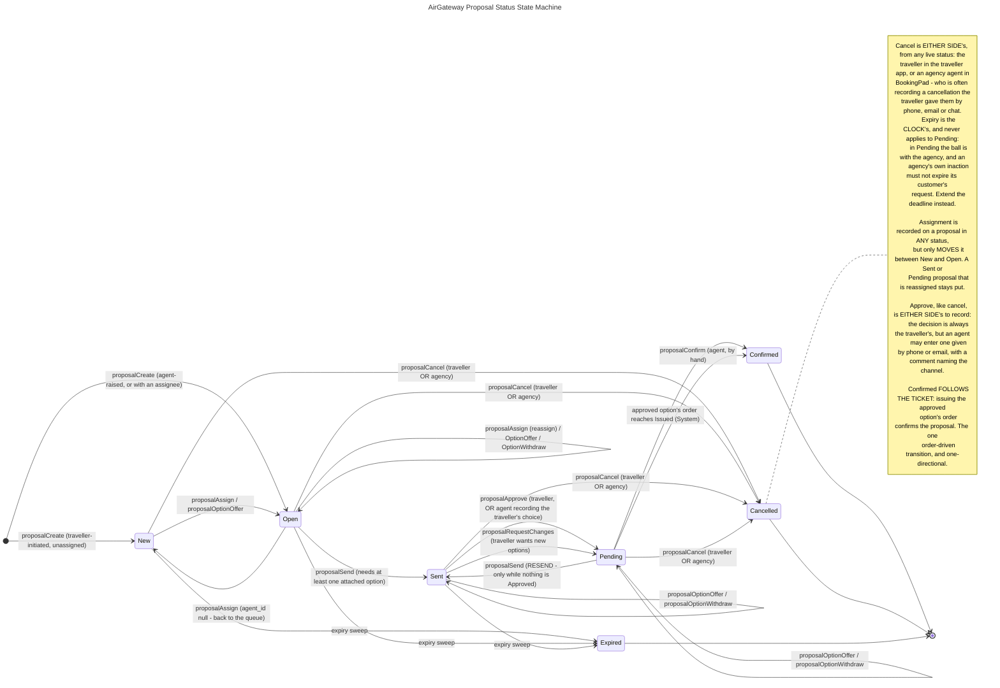

# Proposal State Machine — Single Source of Truth

> **Canonical spec — single source of truth.** This document is *the* authoritative
> definition of proposal **statuses**, **option statuses**, and the **transitions**
> between them for the AirGateway platform. All layers — hub persistence, AGW API V2,
> BookingPad, the traveller app — MUST conform to the exact names and transitions
> defined here. Do not invent statuses, rename them, or add transitions without
> updating this file via PR.
>
> If any code, doc, or skill contradicts this file, this file wins and the other must
> be corrected.

## What a proposal is, and what it is not

A proposal is a **traveller's request for a trip, and the orders an agency attaches to
it as options**. It is an independent wrapper around orders — **not** a projection of
them.

This is the single most important rule in this document, and everything below follows
from it:

- **No proposal status changes because an order changed — with one recorded
  exception.** A proposal moves on an explicit action against the proposal itself: an
  agent takes it, attaches an option, sends it, or cancels it; the traveller approves,
  asks for changes, or cancels; the sweep expires it. The exception is the ticket: **an
  approved option's order reaching `Issued` confirms the proposal.** See
  [Confirmed follows the ticket](#confirmed-follows-the-ticket) for why that one, and
  only that one, is allowed.
- **No order status changes because a proposal changed.** Holding, cancelling and
  issuing orders remain workflows in [ORDER-STATE-MACHINE.md](ORDER-STATE-MACHINE.md),
  invoked separately. Nothing in the proposal machine writes an order, ever.

A proposal carries several orders (one per attached option), so there is no single order
status it could mirror even if that were wanted. The two machines run side by side and
are read together for display.

## Naming conventions

- **Statuses** — PascalCase (`New`, `Pending`). Stored values MUST match exactly;
  display labels may differ but stored values may not.
- **Transitions** — named by the API operation that causes them, in **camelCase**
  (`proposalSend`, `proposalApprove`), matching the AGW API V2 `operationId`.
  There is no PascalCase workflow layer here: unlike orders, a proposal transition is
  **one action in one kick**, never a provider-specific request sequence, so the
  workflow/request distinction that [ORDER-STATE-MACHINE.md](ORDER-STATE-MACHINE.md)
  needs has nothing to disambiguate.
- **History actions** — PascalCase, past tense (`ProposalRaised`, `OptionApproved`).

### The namespace: `/v2/proposals`, outside `air`

Proposals live at the **root**, under `/v2/proposals`, and their operations are
`proposal*` — never `airProposal*`. The rule is normative in
[NAMING.md](NAMING.md); the short form of it is:

**A proposal is a container an agent fills, and a container is named for the container,
not for what is put inside it.** An agent attaches air orders as options today because
air is what the platform sells today. The proposal itself has no provider, no offer and
no PNR — it has a traveller, a request, a status, an assignee and a history, and every
one of those reads identically the day the option attached is a hotel, a rail leg or an
insurance policy. Naming the container after its current contents would bake today's
product scope into a public URL, in the one place the platform cannot cheaply correct it.

This is the same call already recorded for profiles (*"outside `air`, because no airline
is involved in creating one"*) and already made for the agency roster, whose
`/v2/air/agency/agents` is deprecated in favour of `/v2/agency/agents`.

Options are a **sub-resource** of a proposal, so their operations are
`proposalOptionOffer`, `proposalOptionWithdraw` and `proposalOptionDiscard` — namespace,
resource, verb last — not `proposalOfferOption`.

### `Pending` means two different things, and both are correct

`Pending` is a **proposal** status *and* an **order** status, and they do not mean the
same thing:

| | Means |
|---|---|
| **Proposal** `Pending` | The ball is with the **agency**. The traveller has acted — approved an option, or asked for changes — and an agent now owes them something. |
| **Order** `Pending` | The order is **held with the airline**, unticketed, inside its payment time limit. |

This overlap is **deliberate and recorded**, not an oversight: `Pending` is what agents
actually say about a proposal, so the name is kept and the cost is paid here instead:

- **Never write or say a bare "Pending".** In code, in logs, in UI copy and in support
  conversations it is always *proposal status* `Pending` or *order status* `Pending`.
- A response can legitimately carry a proposal in `Pending` containing an order in
  `Pending`, meaning two unrelated things. Anything rendering both MUST label which is
  which.
- Field names carry the entity: `proposal.status` and `options[].order.status` are never
  flattened into one `status` in the same object.

## The 7 proposal statuses

**These seven are the complete set.** A proposal is always in exactly one of them, and
no other value may ever be written to `proposal.status`.

| Status | Meaning | Waiting on | Terminal |
|---|---|---|---|
| `New` | Fresh new traveller-initiated proposal request. | the agency | no |
| `Open` | Proposal request accepted and/or assigned to an agent. | the agency | no |
| `Sent` | The proposal has some orders attached (at least one) and has been sent to the traveller for review/approval. | the traveller | no |
| `Pending` | Requires agent action. The traveller has approved one, or added comments/detail to get new options. Can be **resent**, which sets it to `Sent` again. | the agency | no |
| `Expired` | The expiration time of the proposal is due. | — | **yes** |
| `Cancelled` | The proposal was actively cancelled: by the traveller, or by the **agency** at any time and from any live status — including a cancellation the traveller gave them outside the platform. | — | **yes** |
| `Confirmed` | The traveller has approved one or more orders among the options, their orders have been issued, and the proposal is fulfilled. Reached the moment an approved option's order reaches `Issued`, or by an agent confirming explicitly. | — | **yes** |

### Why each one exists

**`New`** — the entry status for a traveller-initiated request that nobody has picked
up. It is the only status meaning *nobody is on this*, which is exactly what an agency
inbox needs to count.

**`Open`** — the working status. Splitting it out of `New` answers a question `New`
alone could not: **is anyone on this?** Without it, a request assigned to an agent three
days ago is indistinguishable in the inbox from one that arrived a minute ago, and an
agency cannot tell an untouched backlog from a busy one.

**`Sent`** — the traveller has something to look at. Note that attaching an order and
sending are **two separate acts**: an agent assembles up to three options while the
proposal is still `Open`, then sends once. This is what makes "resend" meaningful.

**`Pending`** — the agency owes the traveller a move. Reached two ways, and the status
alone does not distinguish them (the trail does):

1. the traveller **approved** one or more options → the agent must issue and confirm;
2. the traveller **asked for changes** or added detail → the agent must revise the
   options and resend.

**`Expired`** — the traveller's deadline lapsed with nothing agreed.

**`Cancelled`** — the engagement was called off on purpose. An *active* decision, which
is what separates it from `Expired`: being turned down and nobody acting in time are
different signals for an agency, and an agency that cannot tell them apart cannot tell
whether its options were bad or merely late.

**Either side may cancel, from any live status.** The traveller cancels in the traveller
app; an **agency agent may cancel a proposal in `New`, `Open`, `Sent` or `Pending`**, at
any point, from BookingPad. See
[Cancellation is either side's](#cancellation-is-either-sides) — the agency path is not a
lesser one, and it is the one that carries the traveller's decision when that decision
arrived by phone, email or chat rather than through the traveller app.

**`Confirmed`** — the only status meaning the trip is agreed. Reached in two ways that
record the same fact: the approved option's order reaching `Issued` — the ticket is what
fulfils the request, so the proposal follows it, on the trail against `System` naming the
order — or an agent confirming by hand, for an order ticketed outside the platform. See
[Confirmed follows the ticket](#confirmed-follows-the-ticket). It is never reached from
any other order status, and never while nothing is `Approved`.

## Diagram

## Transitions — the normative table

Every valid `(from, to)` pair, the operation that causes it, who may cause it, and the
history entry it writes. **Anything not in this table is invalid** and MUST be rejected
with `409 Conflict`.

| From | To | Operation | Actor | History written |
|---|---|---|---|---|
| — | `New` | `proposalCreate` (no assignee) | Traveller | `ProposalRaised` |
| — | `Open` | `proposalCreate` (with assignee) | Agent | `ProposalRaised`, `AgentAssigned` |
| `New` | `Open` | `proposalAssign` (`agentId` given) | Agent, Admin | `AgentAssigned` |
| `New` | `Open` | `proposalOptionOffer` — attaching claims it for the acting agent | Agent | `AgentAssigned`, `OptionOffered` |
| `Open` | `New` | `proposalAssign` (`agentId` null) | Agent, Admin | `AgentAssigned` |
| `Open` | `Open` | `proposalAssign` (different agent) | Agent, Admin | `AgentAssigned` |
| `Open` | `Open` | `proposalOptionOffer` / `proposalOptionWithdraw` | Agent | `OptionOffered` / `OptionWithdrawn` |
| `Open` | `Sent` | `proposalSend` | Agent | `ProposalSent` |
| `Sent` | `Sent` | `proposalOptionOffer` / `proposalOptionWithdraw` | Agent | `OptionOffered` / `OptionWithdrawn` |
| `Sent` | `Pending` | `proposalApprove` | Traveller, Agent (comment required) | `OptionApproved` |
| `Sent` | `Pending` | `proposalRequestChanges` | Traveller | `ChangesRequested` |
| `Pending` | `Pending` | `proposalOptionOffer` / `proposalOptionWithdraw` | Agent | `OptionOffered` / `OptionWithdrawn` |
| `Pending` | `Sent` | `proposalSend` (resend) | Agent | `ProposalSent` (`resend: true`) |
| `Pending` | `Confirmed` | an `Approved` option's order reaches `Issued` | System | `ProposalConfirmed` (`trigger: OrderIssued`, `order`, `option`) |
| `Pending` | `Confirmed` | `proposalConfirm` | Agent | `ProposalConfirmed` |
| `New` | `Cancelled` | `proposalCancel` | Traveller, Agent, Admin | `ProposalCancelled` |
| `Open` | `Cancelled` | `proposalCancel` | Traveller, Agent, Admin | `ProposalCancelled` |
| `Sent` | `Cancelled` | `proposalCancel` | Traveller, Agent, Admin | `ProposalCancelled` |
| `Pending` | `Cancelled` | `proposalCancel` | Traveller, Agent, Admin | `ProposalCancelled` |
| `New` | `Expired` | expiry sweep | System | `ProposalExpired` |
| `Open` | `Expired` | expiry sweep | System | `ProposalExpired` |
| `Sent` | `Expired` | expiry sweep | System | `ProposalExpired` |

### The guards, stated once

- **`proposalSend` from `Open` requires at least one option in `Offered`.** Sending an
  empty proposal is not a thing a traveller can review.
- **`proposalSend` from `Pending` (resend) is rejected `409` while any option is
  `Approved`.** Resending over an approval would silently discard the traveller's
  decision. Withdraw the approved option first, or confirm.
- **`proposalConfirm` requires at least one option in `Approved`.** `Confirmed` means
  the trip is agreed; nothing else may claim it. The order-driven path carries the same
  guard by construction: it fires only for an order that backs an `Approved` option, and
  only while the proposal is `Pending`.
- **`proposalApprove` is open to the traveller *and* to the agency**, only from `Sent`.
  The choice is always the traveller's; the scope says who typed it, and an agency-side
  approval **MUST carry a comment** naming the channel the choice arrived through. See
  [Approval is the traveller's decision, either side's to record](#approval-is-the-travellers-decision-either-sides-to-record).
- **`proposalRequestChanges` is the traveller's alone**, and only from `Sent`. One
  belonging to another traveller is reported **not found**, never forbidden — the two
  must be indistinguishable to a caller guessing ids. The same not-found rule applies to
  every traveller- or agency-scoped operation on this page.
- **`proposalCancel` is open to the traveller *and* to the agency**, from any live
  status — `New`, `Open`, `Sent` or `Pending`. It is the one operation both sides hold.
  Terminal is `409`, and it is the only guard on the transition itself: there is no
  status, no attached option and no approval that blocks a cancel.
- **Cancelling a proposal moves every non-terminal option to `Expired`, `Approved` ones
  included.** The airline holds have to be released whichever way the proposal died, so
  an approved option is no exception — cancelling a `Pending` proposal is normal, not a
  corner case.
- **Assignment never moves a proposal out of `Sent`, `Pending`, or a terminal status.**

### Cancellation is either side's

**A proposal may be cancelled by the agency at any time, from any live status.** Not only
from `New`, and not only before it was sent: `Open`, `Sent` and `Pending` all cancel, and
an approved option does not lock the proposal open.

The reason is that **the platform is not the only channel the traveller has.** A
traveller who has decided not to travel says so wherever it is easiest — a phone call, a
reply to the agent's email, a WhatsApp message — and very often *never* returns to the
traveller app to press the button. That decision is a fact the moment it is made. If the
only way to record it were the traveller's own click, the agency would be left holding a
live proposal and live airline holds on a trip everybody involved knows is off, until the
clock eventually turned it into `Expired` — which would then be a lie about what
happened.

So the agency path exists to record the traveller's decision, not to overrule it:

- **The status is the same `Cancelled`.** There is no separate agency-cancelled status,
  and none is wanted: what happened is that the proposal was called off, and that is one
  fact however it reached the system.
- **An agency-side cancel MUST carry a comment**, unlike the traveller's, where it stays
  optional. The comment names **where the decision came from** — "traveller confirmed by
  phone", "per traveller's email of 12 May". This is the whole point of the path: without
  it the trail says an agency cancelled its own customer's request for no recorded
  reason, and the traveller, who reads this trail, has no way to see their own decision
  in it.
- **`ProposalCancelled` records the actor**, so agency-recorded and traveller-pressed
  cancellations are told apart by *who*, never by a different status.
- **The agent MUST belong to the proposal's own agency.** One belonging to another agency
  is reported **not found**, exactly as it is for the traveller's own operations — the two
  must be indistinguishable to a caller guessing ids.
- **It is visible to the traveller.** `ProposalCancelled` is in the traveller's trail
  (see [The two trails](#the-two-trails)) — a cancellation entered on their behalf is
  exactly the kind of entry they must be able to check.

What this path is **not**: it is not *the agency declined this*. `Cancelled` says the
engagement was called off, and an agent using it is asserting the traveller called it
off. Recording an agency's own refusal to serve a request is still a separate, open gap
— see [Known gaps](#known-gaps).

### Approval is the traveller's decision, either side's to record

**An agent may approve an option on the traveller's behalf.** The reason is the same
out-of-band channel that makes cancellation either side's: a traveller who has picked an
option by phone, or by replying to the agent's email with "the 07:40 one, please", has
decided — and very often never returns to the app to press the button. An agency that
cannot record that decision is blocked by its own process design, sitting on a `Sent`
proposal and three airline holds it has been told which one to ticket.

So, exactly as for cancel:

- **The status and the option outcome are the same.** `Sent` → `Pending`, the option
  `Approved`, its siblings `Rejected`, whichever side entered it.
- **The trail says who typed it.** An agency-side approval is `OptionApproved` with the
  agent as actor and `details.on_behalf_of_traveller: true`; the traveller's own carries
  neither.
- **An agency-side approval MUST carry a comment**, where the traveller's stays optional.
  It names where the decision came from — "traveller confirmed by phone, 08 Sep 11:20".
  Without it the trail would show an agency choosing on its own customer's behalf for no
  recorded reason, and the traveller, who reads this trail, would have no way to see
  their own decision in it.
- **The agent MUST belong to the proposal's own agency**, reported not found otherwise.
- **It is visible to the traveller.** `OptionApproved` is in the traveller's trail.

What this is **not**: it is not the agency choosing for the traveller. An agent using it is
asserting the traveller chose; the comment is the evidence.

### Confirmed follows the ticket

**When an `Approved` option's order reaches `Issued`, the proposal moves `Pending` →
`Confirmed`.** This is the one place the order machine drives the proposal machine, and it
is deliberate, narrow and one-directional.

Why this one is allowed when every other order-driven transition is banned: at that
moment the traveller has approved, and the agency has ticketed exactly what they approved.
There is nothing left for the proposal to wait on, and no fact an agent could add by
pressing a second button. Requiring one would only leave finished proposals sitting in
`Pending` — in the agency's "Require Action" tab, and on the traveller's screen next to
the booking that already fulfils it. The traveller's experience is the point: **the
proposal turns into a booking**, and the app shows the booking.

The guards that keep it narrow:

- The order MUST back an option in **`Approved`**. Issuing an `Offered` sibling, a
  `Rejected` one, or an order that backs no option moves nothing.
- The proposal MUST be in **`Pending`**. Any other status moves nothing.
- Only the transition *to* `Issued` fires it. No other order status — `Cancelled`,
  `Expired`, `Voided`, flown — ever moves a proposal. Those remain facts about the order,
  read alongside the proposal for display and nothing more.
- It writes **`ProposalConfirmed` against `System`**, with `details.trigger:
  "OrderIssued"`, `details.order` and `details.option`, so a reader tells it from an agent
  confirming by hand.
- It happens in the **same transaction** as the order's status write, on every path that
  writes `Issued` — the order update agw-api-v2 sends after `airOrderIssue`, and the
  airline-notification status route alike.

**`proposalConfirm` remains** for the order ticketed outside the platform, or ticketed
before this transition existed. Same guard: at least one option `Approved`.

### Transitions that deliberately do NOT exist

- **`Sent` → `Open` / `New`.** Withdrawing every option does not walk a proposal back:
  the traveller has already been shown something, and a status claiming otherwise would
  lie about the trail. Attach another option and resend, or let it expire.
- **`Pending` → `Expired`.** See the diagram note — the ball is with the agency.
- **Anything out of a terminal status.** `Confirmed`, `Cancelled` and `Expired` are
  final. A change of mind is a **new proposal**, not a resurrection: the trail of the
  first one has to survive intact.
- **Anything derived from an order's status, other than the ticket.** Named again because
  it is the rule most likely to be broken by accident: a backing order reaching
  `Cancelled`, `Expired` or `Voided`, or an *unapproved* order reaching `Issued`, moves
  **nothing** on the proposal. The one exception is spelled out in
  [Confirmed follows the ticket](#confirmed-follows-the-ticket), and it is not a template
  for a second one.

## Assignment is a status change only between `New` and `Open`

`assignedAgentId` is a field on every proposal and may be set, changed or cleared in any
status. Its effect on the status is narrow and total:

| Proposal is | `agentId` given | `agentId` null |
|---|---|---|
| `New` | → `Open` | no-op |
| `Open` | stays `Open` (reassigned) | → `New` |
| `Sent`, `Pending` | no status change | no status change |
| terminal | rejected `409` | rejected `409` |

Two guards, both enforced before anything is written:

- The assignee MUST be a member of **this** agency. The id comes from a picker, and a
  stale or hand-edited one must not be able to park an agency's work on somebody outside
  it. Non-members are rejected `422`.
- Assigning to whoever already holds it is a **successful no-op**, not an error, so a
  double-tapped picker does not litter the trail.

## The 6 option statuses — a DIFFERENT vocabulary

> **These are not proposal statuses and never appear in `proposal.status`.** An option
> is one attached order; it carries its own status on its own axis. Three vocabularies
> meet on a proposal and must never be mixed: the **proposal's** seven statuses above,
> an **option's** six below, and each backing **order's** own statuses in
> [ORDER-STATE-MACHINE.md](ORDER-STATE-MACHINE.md). `Expired` exists in all three and
> means something different in each.

Option statuses record the **selection outcome only** — whether the backing order was
actually cancelled or issued is carried by that order's own status, and the two are
legitimately out of step while an asynchronous cancel is in flight.

| Status | Meaning |
|---|---|
| `Offered` | Attached and choosable. Its backing order is held with the airline in order status `Pending`. |
| `Approved` | The traveller chose this one. **One or more per proposal** — see below. |
| `Rejected` | The traveller approved others and not this one. Its backing order is cancelled, or on its way to being cancelled. |
| `RejectionFailed` | As `Rejected`, but releasing the airline hold failed permanently. An agent must intervene; this status exists so that need is visible rather than buried in a job log. |
| `Withdrawn` | An agent pulled the option back before the traveller acted on it. |
| `Expired` | The backing order's payment time limit lapsed, or the proposal was cancelled or expired. Reached from `Offered` **and** from `Approved`: a cancelled proposal releases its holds whether or not the traveller had chosen this one. |

### A proposal may have MORE THAN ONE approved option

`Confirmed` is defined as *"the traveller approved **one or more** orders among the
options"*. A traveller booking an outbound from one carrier and a return from another is
one proposal with two approved options.

This is a **change from the earlier single-selection model** and it is load-bearing:

- The partial unique index that enforced *at most one* `Approved` option per proposal is
  **removed**. The service enforces *at least one* on confirm instead.
- `proposalApprove` takes a **list** of option ids, applied in one statement. Every
  offered sibling not in that list moves to `Rejected` in the same statement, so there is
  never a moment when some options are approved while others are still on offer.
- Approving is **not** incremental: a second `proposalApprove` replaces the selection
  wholesale rather than adding to it. Two calls that each approve one option leave one
  approved, not two — which is why the operation takes a list.

### Option transitions

| From | To | Cause |
|---|---|---|
| — | `Offered` | `proposalOptionOffer` |
| `Offered` | `Approved` | `proposalApprove` names this option |
| `Offered` | `Rejected` | `proposalApprove` does **not** name this option |
| `Offered` | `Withdrawn` | `proposalOptionWithdraw` |
| `Offered` | `Expired` | `proposalCancel`, the expiry sweep, or the backing order's payment TTL lapsing |
| `Approved` | `Expired` | `proposalCancel` — the proposal was called off after this option was chosen, so its hold is released |
| `Approved` | `Rejected` | a later `proposalApprove` drops it from the selection |
| `Approved` | `Withdrawn` | `proposalOptionWithdraw` — the only way to undo an approval, and it returns the proposal to a resendable state |
| `Rejected` | `RejectionFailed` | the cancellation dispatch reports a permanent failure |

### Rules on attaching an option

- The proposal MUST be in `New`, `Open`, `Sent` or `Pending`. Terminal is `409`.
- The order MUST exist, belong to the **same agency** as the proposal, still be **held**
  (order status `Pending`), and not already back another option. Each is checked
  explicitly, so a rejection says which rule it broke rather than surfacing a database
  error.
- **At most 3 offered options per proposal.** Each is a real airline hold consuming
  inventory and possibly attracting a fee, so the number is bounded rather than left to
  whoever is filling the proposal.
- This operation **attaches** an order; it never shops or holds one. The agent shops and
  holds through the normal order flow, then attaches the result here. This is also the
  entry point for the reverse journey: an agent finishing a booking may attach that
  order to any of their agency's proposals in `New`, `Open`, `Sent` or `Pending`.

## Origin

Where a proposal came from. Both origins run the **identical** lifecycle and both are
approved by the traveller, so this records provenance rather than behaviour.

| Origin | Meaning | Entry status |
|---|---|---|
| `Traveller` | The traveller raised it in the traveller app. | `New` |
| `Agent` | An agent raised it in BookingPad on a traveller's behalf. | `Open` — an agent raising one has already taken it |

## Actors

| Actor | Who |
|---|---|
| `Agent` | An agency agent, acting in BookingPad. |
| `Traveller` | The main (first adult) passenger — the sole approver. |
| `Admin` | An AirGateway operator acting through the hub console. Kept distinct from the agency's own agents so a support intervention is never mistaken for something the agency did. |
| `System` | Nobody performed it by hand: the expiry sweep, the cancellation dispatch. |

## History actions

The trail is **append-only**. An entry has no `updated_at` and is never rewritten — a
correction is a further entry. The actor's name is stored as it stood at the time rather
than joined, so an agent who later leaves or is renamed cannot rewrite what the history
says they did.

| Action | Recorded when |
|---|---|
| `ProposalRaised` | The proposal was created. Always the first entry in a trail. |
| `AgentAssigned` | An agent took the proposal, or it was reassigned or unassigned. |
| `OptionOffered` | An agent attached an option. Details name it and the order backing it. |
| `OptionWithdrawn` | An agent pulled an option back. |
| `ProposalSent` | The proposal was sent to the traveller. `details.resend` is `true` for every send after the first, so the trail shows the round trips rather than flattening them. |
| `ChangesRequested` | The traveller asked for different options or added detail. Their comment is in the details. |
| `OptionApproved` | One or more options were approved. Details name **all** of them, and how many siblings that rejected. Normally the traveller's own act; when an agent recorded a choice the traveller gave them outside the app, the actor is the agent, `details.on_behalf_of_traveller` is `true` and `details.comment` (**mandatory** there) names the channel. |
| `ProposalCancelled` | The proposal was cancelled. The actor says by which side. Comment **optional for the traveller** — forcing one produces filler rather than insight — and **mandatory for an agent or admin**, where it names the external channel the traveller's decision arrived through. |
| `ProposalConfirmed` | The proposal reached `Confirmed`. Against `System` with `details.trigger: "OrderIssued"`, `details.order` and `details.option` when the approved order's ticket confirmed it; against the agent when confirmed by hand. |
| `ProposalExpired` | The deadline fell due. `System` actor. |
| `ExpiryChanged` | The deadline was set, extended or cleared. Details carry old and new. |
| `NoteAdded` | An internal free-text note. The agency talking to itself. |
| `TravellerMessaged` | An agent wrote **to the traveller**. Kept apart from `NoteAdded` because the trail is evidence an agency shows that customer, so which of the two it was has to be legible. |
| `AgencyMessaged` | The traveller wrote **to the agency**. The other half of `TravellerMessaged`, and the reason the trail needs no separate messages resource: the pair *is* the thread, each entry carrying its text in `details.message`, and the direction is legible from the action alone rather than inferred from the actor. Both are visible to both sides. |
| `OptionCancelRequested` | A rejected option's airline hold was handed to the cancellation dispatch. One entry **per attempt**, so the trail shows the retrying rather than hiding it. `System` actor. |
| `OptionCancelFailed` | Releasing a rejected option's hold failed permanently. `System` actor. |

### The two trails

An agency reads **all** of it. A traveller reads the story of their own request —
raised, sent, offered, withdrawn, approved, changes requested, cancelled, confirmed,
expired, deadline changed, and both halves of the conversation they are party to
(`TravellerMessaged`, `AgencyMessaged`) — **including a `ProposalCancelled` or an
`OptionApproved` an agent entered on their behalf, comment and all**, and **not** the
parts where the agency is talking
to itself: `NoteAdded`, `AgentAssigned`, `OptionCancelRequested`, `OptionCancelFailed`,
and anything an `Admin` did. That split is why an internal note and a message to the
traveller are separate actions rather than one.

## Activity — the trail, aggregated

The trail answers *what happened to **this** proposal*. An agency has to answer the same
question from the other end: **what has happened that nobody here has seen yet** —
across every proposal at once, newest first — because the alternative is an agent
opening twenty requests to find the one customer who is waiting on them.

That is **one read over the same entries**, never a second store. Nothing below adds a
row to a trail, changes what a trail contains, or gives a proposal a second history:

| Operation | Path | What it does |
|---|---|---|
| `proposalActivityList` | `GET /v2/proposals/activity` | Every history entry in the caller's scope, newest first, each flagged seen or unread, each naming the proposal it belongs to. |
| `proposalActivityAcknowledge` | `POST /v2/proposals/activity/acknowledge` | Records that the caller's side has seen one proposal's trail — or every trail in scope — up to a given entry. |

### Scoped by audience, never by status

The feed is scoped exactly as every other proposal read is: an agency sees its own
proposals' entries, a traveller sees their own, and a traveller sees only the half of
each trail [the two trails](#the-two-trails) rule already grants them.

**There is no `status` filter, by design — not as a default, not as an option.** A
terminal proposal cannot produce new activity, so filtering by status buys nothing and
costs the feed its integrity: the moment a proposal reached `Confirmed` or `Cancelled`,
every entry on it would vanish from the feed **including the entry that just recorded
it**, and a feed that can never show a confirmation is not a feed.

The stronger reason is the cancellation dispatch. It is asynchronous and writes
`OptionCancelRequested` / `OptionCancelFailed` some time after the approval that queued
them, so one of those entries can land on a proposal that has gone terminal in between.
A status-filtered feed would hide precisely the `OptionCancelFailed` that needs an
agent, on precisely the proposals nobody is looking at any more. Time ordering already
buries dead proposals; that is the whole mechanism required.

### Seen is the agency's, not each agent's

An agency inbox is worked by a desk, not by one person. **Seen means seen by anybody on
that side**: one agent opening a request clears it for all of them, which is what stops
five agents chasing the same message.

The cost is real and is accepted rather than hidden: an agent cannot tell *nobody has
read this* from *a colleague read it and did nothing*. So an entry reports **who**
cleared it and **when**, and a surface says so — "read by maria@ 20 min ago" — instead
of merely dropping a dot. If a desk ever needs *unread by me*, that is a second audience
row and not a redesign.

The two sides count independently. An agent reading the trail does not mark it read for
the traveller, and the traveller reading it in their app does not clear the agency's
badge.

### The watermark is an entry id, never a timestamp

Seen state is a **watermark per (proposal, audience)**: the highest entry the audience
has seen. Unread is everything above it. One row per proposal rather than one per entry,
and one write per proposal opened.

**It is keyed on the entry's identity, never on `occurred_at`.** `occurred_at` is when
the action *happened*, which is deliberately not when the row was written — a queued job
stamps the moment it acted. A timestamp watermark would therefore swallow, in silence,
every entry written after a watermark that already covers its timestamp. The identity
only ever goes up.

Two corollaries that follow from that and are normative:

- **The watermark only moves forward.** Acknowledging an older entry than the one
  already recorded is a successful no-op, so a re-read, a double-tapped button and two
  agents acting at once cannot un-see anything.
- **Seen is computed per entry, not per proposal.** A proposal read an hour ago that the
  traveller has written on twice since comes back with those two entries unread and
  everything under them seen. A per-proposal flag would collapse exactly the distinction
  the feed exists to draw.

### Acknowledging is an explicit write

**Reading a trail does not mark it seen.** `proposalHistory` and `proposalActivityList`
are safe, repeatable reads and must stay that way: a `GET` that moves the watermark
means a browser prefetch, a re-render, or a partner polling the trail silently clears an
agency's unread state, and it makes the history endpoint unsafe to retry.

So a surface acknowledges deliberately — when it has actually put the trail in front of
a person, and from an explicit "mark all as read". Acknowledging with no proposal named
covers every proposal in scope.

### Activity is read, not delivered

Hub has no notification channel. Nothing here emails, pushes or otherwise delivers
anything; the feed is a thing an agent looks at, and a message reaches its recipient
when they next read it. That is a known gap below, not a property of the design — when
delivery arrives it hangs off these same entries.

### The layer contract for activity

| Layer | What it owns |
|---|---|
| **hub persistence** | `bookings.proposal_history_seen` — the watermark, keyed `(proposal_id, audience, audience_id)` with `audience` in (`Agency`, `Traveller`). **Mutable by design, which is exactly why it is not a column on an entry**: the trail stays append-only and carries no record of who read it. |
| **hub-api-v2** | `GET /agw/proposals/activity`, `POST /agw/proposals/activity/acknowledge`, scoped by the same `agency_id`-or-`traveller_id` pair every other proposal read takes. The traveller's narrower trail is applied by the one existing filter, never re-implemented per endpoint. |
| **agw-api-v2** | The two operations above. Page size is **50, both maximum and default** — hub's pager caps at 50 and a spec that promised more would 500. |
| **BookingPad** | The bell and the feed live **inside the Proposals views only**: right-aligned on the status-tab row, with the feed as a view of the existing `/proposals` route rather than a route of its own. An agent elsewhere in the product sees no badge, deliberately, for now. |
| **Traveller app** | May read the same endpoint under its own `Traveller` audience. Not required to. |

**An unknown action must still render.** Every surface reading the feed shows an action
it does not recognise under its raw name rather than dropping the row — the rule the
trail already follows, and what lets one layer lag another by a deploy without losing
entries.

## The traveller's view: a proposal becomes a booking

The traveller app has two lists, and the rule for each is short:

- **Proposals** shows the traveller's **live** proposals — `New`, `Open`, `Sent`,
  `Pending` — plus `Cancelled` and `Expired` as history. **`Confirmed` is not shown
  there.** A confirmed proposal has turned into a booking, and the booking is what the
  traveller now looks at.
- **Bookings** shows every order **from `Issued` onwards** — issued, flown, part-flown —
  that the traveller is a passenger on, **whether or not a proposal ever existed for it**.
  An agency may deliver a ready-to-fly booking with no proposal at all, and it appears
  exactly like one that came out of a proposal; the proposal process is a way to get to a
  booking, not a prerequisite for one.

Two consequences worth stating:

- **A held order is not a booking.** Orders in order status `Pending` are not listed
  under Bookings. They are the agency's shelf — options an agent is assembling, possibly
  not yet `Sent` — and showing them would leak the shelf to the traveller before the
  agent decided to show it, as well as presenting an unticketed hold as a trip.
- **Cancelled options disappear on their own.** When an approval rejects the siblings and
  the dispatch cancels their holds, those orders leave order status `Pending` for
  `Cancelled`, and were never bookings in the first place.

This is why [Confirmed follows the ticket](#confirmed-follows-the-ticket) matters to the
traveller and not only to the agency: the moment the ticket is issued, the proposal leaves
one list and the booking appears in the other, with no button pressed by anyone.

## Deadlines: the proposal's, and the orders'

Two independent clocks, and conflating them is a bug:

- **The proposal's `expiresAt`** is the traveller's deadline to approve, set when the
  proposal is raised and extendable by an agent. When it falls due, the **proposal**
  moves to `Expired` — but only from `New`, `Open` or `Sent`.
- **Each backing order's payment time limit** is the airline's deadline to pay. When one
  lapses, that **option** moves to `Expired`. The proposal does not move.

A proposal with no deadline never expires on its own.

## The layer contract

Hub is the **only** layer that persists this vocabulary. It declares the closed sets in
code and reconciles them into `bookings.proposal_statuses`,
`bookings.proposal_option_statuses` and `bookings.proposal_history_actions` at start-up,
which the foreign keys on the status columns make load-bearing: an undeclared status is
rejected at the write boundary rather than created on demand.

| Layer | Where the names live | Rule |
|---|---|---|
| **hub-api-v2** | `domain/proposal.go` — `ProposalStatuses`, `ProposalOptionStatuses`, `ProposalHistoryActions` | The single place the taxonomy is edited. Every guard uses the declared constants, never a string literal. |
| **hub persistence** | `bookings.proposal_statuses` and siblings, reconciled at start-up | FK-enforced. A status not declared in code cannot be written. |
| **hub tests** | `testdata/database/seeds/proposal_statuses.json` and siblings | The harness does **not** run start-up reconciliation, so a new status needs a matching seed row or every test touching it fails. |
| **agw-api-v2** | the `status` enum in `specs/ndcjsonapiv2.openapi.yaml` | Mirrors hub's set. Never writes one hub does not declare. |
| **BookingPad** | `shared/utils/proposal-status.utils.ts`, `features/proposals/models/proposal-status-tabs.ts` | Mirrors hub's set. Labels may differ from stored values; stored values may not. |
| **Traveller app** | its own status mirror | Same rule. |

**Adding or renaming a status touches all six.** Behaviour changes and spec changes land
in the same PR — this file is updated first, never after the fact.

## Known gaps

Deliberate, tracked, and never precedent.

| Gap | Status |
|---|---|
| **The activity feed is specified here and not yet built.** The two operations above, `bookings.proposal_history_seen` and the BookingPad bell are normative but unimplemented; this page landed first, as it must. Following in hub, then AGW API V2, then BookingPad. | In progress |
| **Nothing is delivered.** There is no notification channel on any layer: no email, no push, no webhook out. An agency learns a traveller wrote by looking, which is what makes the feed load-bearing rather than a convenience. Delivery would hang off these entries and change nothing above. | Open |
| **The expiry sweep is not implemented.** `Expired` is declared, seeded and mirrored everywhere, and the transitions above are normative — but nothing yet moves a proposal into it. It will follow the `/agw/orders/status/expire` precedent: a cross-tenant scheduler-driven `POST` deriving the outstanding set from current state on every run, which makes the sweep itself the retry. | Open |
| **An agency cannot record that *it* turned a request down.** The agency can now cancel from any live status, but `Cancelled` asserts the **traveller's** decision however it was entered, so *the agency declined this* is still not recordable and "how often did we turn work away?" cannot be answered apart from "how often did customers say no?". An agency-side terminal status is the fix if that question is ever asked — reusing `Cancelled` for it is not, because it would corrupt the one thing that status means. | Open |
| **The vocabulary is migrated in hub; the other layers follow.** hub-api-v2 stores the seven statuses above, the six option statuses and the action names on this page (migration `20260908135533_proposals_canonical_vocabulary`), and ships `proposalCancel` (both scopes, any live status), `proposalApprove` (both scopes) and Confirmed-on-issue. AGW API V2, BookingPad and the traveller app are being migrated in the PRs that follow hub's; until each lands, that layer still speaks the older set. | In progress |
| **Send is not its own operation.** Attaching the first option still moves the proposal to `Sent` on every layer; `proposalSend` and the `Pending` → `Sent` resend do not exist, and `proposalRequestChanges` does not either. The transitions above are normative regardless. | Open |
| **Approve takes one option, not a list.** `proposalApprove` on every layer approves a single `option_agw_id`; the wholesale-replace list semantics above are not implemented. The at-most-one index is gone from the database, so nothing blocks the list — it is only not built. | Open |
| **Expired options' airline holds are not released.** Cancelling a proposal moves its `Offered` and `Approved` options to `Expired`, but the cancellation dispatch follows `Rejected` options only, so those orders stay held with the airline until their own payment time limit lapses. Extending the dispatch to `Expired` options of a `Cancelled` proposal is the fix; naming a failure there `RejectionFailed` would be wrong, so it wants its own status or a rename first. | Open |
| **BookingPad has no agent-side approve or cancel yet.** Both exist on hub; BookingPad's action bar still shows the status-gated "Reject" that the old close carried, and no per-option approve. Follows in the BookingPad PR. | In progress |
