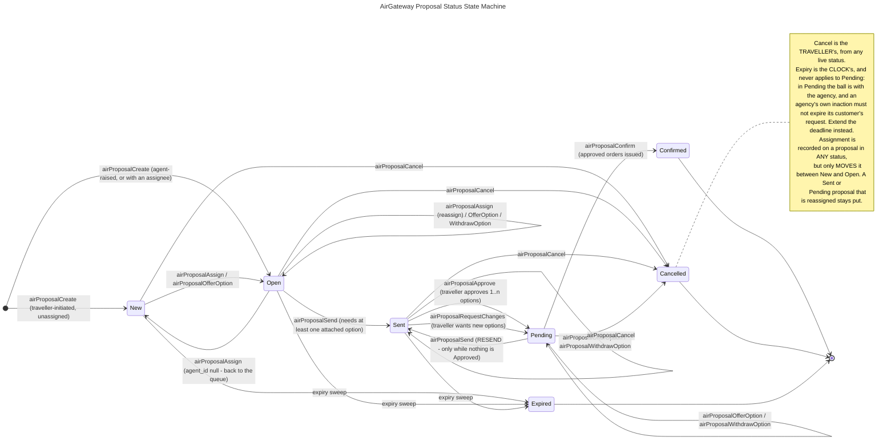

# Proposal State Machine — Single Source of Truth

> **Canonical spec — single source of truth.** This document is *the* authoritative
> definition of proposal **statuses**, **option statuses**, and the **transitions**
> between them for the AirGateway platform. All layers — hub persistence, AGW API V2,
> BookingPad, the traveller app — MUST conform to the exact names and transitions
> defined here. Do not invent statuses, rename them, or add transitions without
> updating this file via PR.
>
> If any code, doc, or skill contradicts this file, this file wins and the other must
> be corrected.

## What a proposal is, and what it is not

A proposal is a **traveller's request for a trip, and the orders an agency attaches to
it as options**. It is an independent wrapper around orders — **not** a projection of
them.

This is the single most important rule in this document, and everything below follows
from it:

- **No proposal status changes because an order changed.** A proposal moves only on an
  explicit action against the proposal itself: an agent takes it, attaches an option,
  sends it; the traveller approves, asks for changes, or cancels; the sweep expires it.
- **No order status changes because a proposal changed.** Holding, cancelling and
  issuing orders remain workflows in [ORDER-STATE-MACHINE.md](ORDER-STATE-MACHINE.md),
  invoked separately.

A proposal carries several orders (one per attached option), so there is no single order
status it could mirror even if that were wanted. The two machines run side by side and
are read together for display; **neither drives the other.**

## Naming conventions

- **Statuses** — PascalCase (`New`, `Pending`). Stored values MUST match exactly;
  display labels may differ but stored values may not.
- **Transitions** — named by the API operation that causes them, in **camelCase**
  (`airProposalSend`, `airProposalApprove`), matching the AGW API V2 `operationId`.
  There is no PascalCase workflow layer here: unlike orders, a proposal transition is
  **one action in one kick**, never a provider-specific request sequence, so the
  workflow/request distinction that [ORDER-STATE-MACHINE.md](ORDER-STATE-MACHINE.md)
  needs has nothing to disambiguate.
- **History actions** — PascalCase, past tense (`ProposalRaised`, `OptionApproved`).

### `Pending` means two different things, and both are correct

`Pending` is a **proposal** status *and* an **order** status, and they do not mean the
same thing:

| | Means |
|---|---|
| **Proposal** `Pending` | The ball is with the **agency**. The traveller has acted — approved an option, or asked for changes — and an agent now owes them something. |
| **Order** `Pending` | The order is **held with the airline**, unticketed, inside its payment time limit. |

This overlap is **deliberate and recorded**, not an oversight. It replaces the earlier
`ActionRequired`, which existed precisely to avoid the collision. The collision is
accepted because `Pending` is what agents actually say, and the cost is paid here
instead:

- **Never write or say a bare "Pending".** In code, in logs, in UI copy and in support
  conversations it is always *proposal status* `Pending` or *order status* `Pending`.
- A response can legitimately carry a proposal in `Pending` containing an order in
  `Pending`, meaning two unrelated things. Anything rendering both MUST label which is
  which.
- Field names carry the entity: `proposal.status` and `options[].order.status` are never
  flattened into one `status` in the same object.

## The 7 proposal statuses

| Status | Meaning | Waiting on | Terminal |
|---|---|---|---|
| `New` | Fresh traveller-initiated request. Nobody has taken it. | the agency | no |
| `Open` | Accepted and/or assigned to an agent, who is working it. | the agency | no |
| `Sent` | At least one order is attached and the proposal has been sent to the traveller for review. | the traveller | no |
| `Pending` | Requires agent action: the traveller approved an option, or asked for changes. Can be **resent**, which returns it to `Sent`. | the agency | no |
| `Expired` | The proposal's expiration time fell due. | — | **yes** |
| `Cancelled` | The traveller actively cancelled the proposal, with or without comments. | — | **yes** |
| `Confirmed` | The traveller approved one or more of the offered orders and the proposal is fulfilled. | — | **yes** |

### Why each one exists

**`New`** — the entry status for a traveller-initiated request that nobody has picked
up. It is the only status meaning *nobody is on this*, which is exactly what an agency
inbox needs to count.

**`Open`** — the working status. Splitting it out of `New` answers a question `New`
alone could not: **is anyone on this?** Without it, a request assigned to an agent three
days ago is indistinguishable in the inbox from one that arrived a minute ago, and an
agency cannot tell an untouched backlog from a busy one.

**`Sent`** — the traveller has something to look at. Note that attaching an order and
sending are **two separate acts**: an agent assembles up to three options while the
proposal is still `Open`, then sends once. This is what makes "resend" meaningful.

**`Pending`** — the agency owes the traveller a move. Reached two ways, and the status
alone does not distinguish them (the trail does):

1. the traveller **approved** one or more options → the agent must issue and confirm;
2. the traveller **asked for changes** or added detail → the agent must revise the
   options and resend.

**`Expired`** — the traveller's deadline lapsed with nothing agreed.

**`Cancelled`** — the traveller pulled out. An *active* decision, which is what
separates it from `Expired`: being turned down and nobody acting in time are different
signals for an agency, and an agency that cannot tell them apart cannot tell whether its
options were bad or merely late.

**`Confirmed`** — the only status meaning the trip is agreed. Deliberately an explicit
agent action, **not** derived from a backing order reaching `Issued`: an airline
ticketing something and an engagement being finished are different facts.

## Diagram

## Transitions — the normative table

Every valid `(from, to)` pair, the operation that causes it, who may cause it, and the
history entry it writes. **Anything not in this table is invalid** and MUST be rejected
with `409 Conflict`.

| From | To | Operation | Actor | History written |
|---|---|---|---|---|
| — | `New` | `airProposalCreate` (no assignee) | Traveller | `ProposalRaised` |
| — | `Open` | `airProposalCreate` (with assignee) | Agent | `ProposalRaised`, `AgentAssigned` |
| `New` | `Open` | `airProposalAssign` (`agentId` given) | Agent, Admin | `AgentAssigned` |
| `New` | `Open` | `airProposalOfferOption` — attaching claims it for the acting agent | Agent | `AgentAssigned`, `OptionOffered` |
| `Open` | `New` | `airProposalAssign` (`agentId` null) | Agent, Admin | `AgentAssigned` |
| `Open` | `Open` | `airProposalAssign` (different agent) | Agent, Admin | `AgentAssigned` |
| `Open` | `Open` | `airProposalOfferOption` / `airProposalWithdrawOption` | Agent | `OptionOffered` / `OptionWithdrawn` |
| `Open` | `Sent` | `airProposalSend` | Agent | `ProposalSent` |
| `Sent` | `Sent` | `airProposalOfferOption` / `airProposalWithdrawOption` | Agent | `OptionOffered` / `OptionWithdrawn` |
| `Sent` | `Pending` | `airProposalApprove` | Traveller | `OptionApproved` |
| `Sent` | `Pending` | `airProposalRequestChanges` | Traveller | `ChangesRequested` |
| `Pending` | `Pending` | `airProposalOfferOption` / `airProposalWithdrawOption` | Agent | `OptionOffered` / `OptionWithdrawn` |
| `Pending` | `Sent` | `airProposalSend` (resend) | Agent | `ProposalSent` (`resend: true`) |
| `Pending` | `Confirmed` | `airProposalConfirm` | Agent | `ProposalConfirmed` |
| `New` | `Cancelled` | `airProposalCancel` | Traveller | `ProposalCancelled` |
| `Open` | `Cancelled` | `airProposalCancel` | Traveller | `ProposalCancelled` |
| `Sent` | `Cancelled` | `airProposalCancel` | Traveller | `ProposalCancelled` |
| `Pending` | `Cancelled` | `airProposalCancel` | Traveller | `ProposalCancelled` |
| `New` | `Expired` | expiry sweep | System | `ProposalExpired` |
| `Open` | `Expired` | expiry sweep | System | `ProposalExpired` |
| `Sent` | `Expired` | expiry sweep | System | `ProposalExpired` |

### The guards, stated once

- **`airProposalSend` from `Open` requires at least one option in `Offered`.** Sending an
  empty proposal is not a thing a traveller can review.
- **`airProposalSend` from `Pending` (resend) is rejected `409` while any option is
  `Approved`.** Resending over an approval would silently discard the traveller's
  decision. Withdraw the approved option first, or confirm.
- **`airProposalConfirm` requires at least one option in `Approved`.** `Confirmed` means
  the trip is agreed; nothing else may claim it.
- **`airProposalApprove` and `airProposalRequestChanges` are the traveller's alone**, and
  only from `Sent`. One belonging to another traveller is reported **not found**, never
  forbidden — the two must be indistinguishable to a caller guessing ids.
- **`airProposalCancel` is the traveller's alone**, from any live status.
- **Assignment never moves a proposal out of `Sent`, `Pending`, or a terminal status.**

### Transitions that deliberately do NOT exist

- **`Sent` → `Open` / `New`.** Withdrawing every option does not walk a proposal back:
  the traveller has already been shown something, and a status claiming otherwise would
  lie about the trail. Attach another option and resend, or let it expire.
- **`Pending` → `Expired`.** See the diagram note — the ball is with the agency.
- **Anything out of a terminal status.** `Confirmed`, `Cancelled` and `Expired` are
  final. A change of mind is a **new proposal**, not a resurrection: the trail of the
  first one has to survive intact.
- **Anything derived from an order's status.** Named again because it is the rule most
  likely to be broken by accident: a backing order reaching `Issued`, `Cancelled` or
  `Expired` moves **nothing** on the proposal.

## Assignment is a status change only between `New` and `Open`

`assignedAgentId` is a field on every proposal and may be set, changed or cleared in any
status. Its effect on the status is narrow and total:

| Proposal is | `agentId` given | `agentId` null |
|---|---|---|
| `New` | → `Open` | no-op |
| `Open` | stays `Open` (reassigned) | → `New` |
| `Sent`, `Pending` | no status change | no status change |
| terminal | rejected `409` | rejected `409` |

Two guards, both enforced before anything is written:

- The assignee MUST be a member of **this** agency. The id comes from a picker, and a
  stale or hand-edited one must not be able to park an agency's work on somebody outside
  it. Non-members are rejected `422`.
- Assigning to whoever already holds it is a **successful no-op**, not an error, so a
  double-tapped picker does not litter the trail.

## The 6 option statuses

An option is one held order attached to a proposal. Option statuses record the
**selection outcome only** — whether the backing order was actually cancelled or issued
is carried by that order's own status, and the two are legitimately out of step while an
asynchronous cancel is in flight.

| Status | Meaning |
|---|---|
| `Offered` | Attached and choosable. Its backing order is held with the airline in order status `Pending`. |
| `Approved` | The traveller chose this one. **One or more per proposal** — see below. |
| `Rejected` | The traveller approved others and not this one. Its backing order is cancelled, or on its way to being cancelled. |
| `RejectionFailed` | As `Rejected`, but releasing the airline hold failed permanently. An agent must intervene; this status exists so that need is visible rather than buried in a job log. |
| `Withdrawn` | An agent pulled the option back before the traveller acted on it. |
| `Expired` | The backing order's payment time limit lapsed, or the proposal was cancelled or expired, before this option was taken up. |

### A proposal may have MORE THAN ONE approved option

`Confirmed` is defined as *"the traveller approved **one or more** orders among the
options"*. A traveller booking an outbound from one carrier and a return from another is
one proposal with two approved options.

This is a **change from the earlier single-selection model** and it is load-bearing:

- The partial unique index that enforced *at most one* `Approved` option per proposal is
  **removed**. The service enforces *at least one* on confirm instead.
- `airProposalApprove` takes a **list** of option ids, applied in one statement. Every
  offered sibling not in that list moves to `Rejected` in the same statement, so there is
  never a moment when some options are approved while others are still on offer.
- Approving is **not** incremental: a second `airProposalApprove` replaces the selection
  wholesale rather than adding to it. Two calls that each approve one option leave one
  approved, not two — which is why the operation takes a list.

### Option transitions

| From | To | Cause |
|---|---|---|
| — | `Offered` | `airProposalOfferOption` |
| `Offered` | `Approved` | `airProposalApprove` names this option |
| `Offered` | `Rejected` | `airProposalApprove` does **not** name this option |
| `Offered` | `Withdrawn` | `airProposalWithdrawOption` |
| `Offered` | `Expired` | `airProposalCancel`, the expiry sweep, or the backing order's payment TTL lapsing |
| `Approved` | `Rejected` | a later `airProposalApprove` drops it from the selection |
| `Approved` | `Withdrawn` | `airProposalWithdrawOption` — the only way to undo an approval, and it returns the proposal to a resendable state |
| `Rejected` | `RejectionFailed` | the cancellation dispatch reports a permanent failure |

### Rules on attaching an option

- The proposal MUST be in `New`, `Open`, `Sent` or `Pending`. Terminal is `409`.
- The order MUST exist, belong to the **same agency** as the proposal, still be **held**
  (order status `Pending`), and not already back another option. Each is checked
  explicitly, so a rejection says which rule it broke rather than surfacing a database
  error.
- **At most 3 offered options per proposal.** Each is a real airline hold consuming
  inventory and possibly attracting a fee, so the number is bounded rather than left to
  whoever is filling the proposal.
- This operation **attaches** an order; it never shops or holds one. The agent shops and
  holds through the normal order flow, then attaches the result here. This is also the
  entry point for the reverse journey: an agent finishing a booking may attach that
  order to any of their agency's proposals in `New`, `Open`, `Sent` or `Pending`.

## Origin

Where a proposal came from. Both origins run the **identical** lifecycle and both are
approved by the traveller, so this records provenance rather than behaviour.

| Origin | Meaning | Entry status |
|---|---|---|
| `Traveller` | The traveller raised it in the traveller app. | `New` |
| `Agent` | An agent raised it in BookingPad on a traveller's behalf. | `Open` — an agent raising one has already taken it |

## Actors

| Actor | Who |
|---|---|
| `Agent` | An agency agent, acting in BookingPad. |
| `Traveller` | The main (first adult) passenger — the sole approver. |
| `Admin` | An AirGateway operator acting through the hub console. Kept distinct from the agency's own agents so a support intervention is never mistaken for something the agency did. |
| `System` | Nobody performed it by hand: the expiry sweep, the cancellation dispatch. |

## History actions

The trail is **append-only**. An entry has no `updated_at` and is never rewritten — a
correction is a further entry. The actor's name is stored as it stood at the time rather
than joined, so an agent who later leaves or is renamed cannot rewrite what the history
says they did.

| Action | Recorded when |
|---|---|
| `ProposalRaised` | The proposal was created. Always the first entry in a trail. |
| `AgentAssigned` | An agent took the proposal, or it was reassigned or unassigned. |
| `OptionOffered` | An agent attached an option. Details name it and the order backing it. |
| `OptionWithdrawn` | An agent pulled an option back. |
| `ProposalSent` | The proposal was sent to the traveller. `details.resend` is `true` for every send after the first, so the trail shows the round trips rather than flattening them. |
| `ChangesRequested` | The traveller asked for different options or added detail. Their comment is in the details. |
| `OptionApproved` | The traveller approved one or more options. Details name **all** of them, and how many siblings that rejected. |
| `ProposalCancelled` | The traveller cancelled. Comment optional — forcing one produces filler rather than insight. |
| `ProposalConfirmed` | An agent confirmed after issuing the approved orders. |
| `ProposalExpired` | The deadline fell due. `System` actor. |
| `ExpiryChanged` | The deadline was set, extended or cleared. Details carry old and new. |
| `NoteAdded` | An internal free-text note. The agency talking to itself. |
| `TravellerMessaged` | An agent wrote **to the traveller**. Kept apart from `NoteAdded` because the trail is evidence an agency shows that customer, so which of the two it was has to be legible. |
| `OptionCancelRequested` | A rejected option's airline hold was handed to the cancellation dispatch. One entry **per attempt**, so the trail shows the retrying rather than hiding it. `System` actor. |
| `OptionCancelFailed` | Releasing a rejected option's hold failed permanently. `System` actor. |

### The two trails

An agency reads **all** of it. A traveller reads the story of their own request —
raised, sent, offered, withdrawn, approved, changes requested, cancelled, confirmed,
expired, deadline changed, messaged — and **not** the parts where the agency is talking
to itself: `NoteAdded`, `AgentAssigned`, `OptionCancelRequested`, `OptionCancelFailed`,
and anything an `Admin` did. That split is why an internal note and a message to the
traveller are separate actions rather than one.

## Deadlines: the proposal's, and the orders'

Two independent clocks, and conflating them is a bug:

- **The proposal's `expiresAt`** is the traveller's deadline to approve, set when the
  proposal is raised and extendable by an agent. When it falls due, the **proposal**
  moves to `Expired` — but only from `New`, `Open` or `Sent`.
- **Each backing order's payment time limit** is the airline's deadline to pay. When one
  lapses, that **option** moves to `Expired`. The proposal does not move.

A proposal with no deadline never expires on its own.

## The layer contract

Hub is the **only** layer that persists this vocabulary. It declares the closed sets in
code and reconciles them into `bookings.proposal_statuses`,
`bookings.proposal_option_statuses` and `bookings.proposal_history_actions` at start-up,
which the foreign keys on the status columns make load-bearing: an undeclared status is
rejected at the write boundary rather than created on demand.

| Layer | Where the names live | Rule |
|---|---|---|
| **hub-api-v2** | `domain/proposal.go` — `ProposalStatuses`, `ProposalOptionStatuses`, `ProposalHistoryActions` | The single place the taxonomy is edited. Every guard uses the declared constants, never a string literal. |
| **hub persistence** | `bookings.proposal_statuses` and siblings, reconciled at start-up | FK-enforced. A status not declared in code cannot be written. |
| **hub tests** | `testdata/database/seeds/proposal_statuses.json` and siblings | The harness does **not** run start-up reconciliation, so a new status needs a matching seed row or every test touching it fails. |
| **agw-api-v2** | the `status` enum in `specs/ndcjsonapiv2.openapi.yaml` | Mirrors hub's set. Never writes one hub does not declare. |
| **BookingPad** | `shared/utils/proposal-status.utils.ts`, `features/proposals/models/proposal-status-tabs.ts` | Mirrors hub's set. Labels may differ from stored values; stored values may not. |
| **Traveller app** | its own status mirror | Same rule. |

**Adding or renaming a status touches all six.** Behaviour changes and spec changes land
in the same PR — this file is updated first, never after the fact.

## Migration from the shipped 7-status set

What is on `sandbox` today is **not** this machine. The delta, for whoever implements it:

| Shipped (sandbox) | Canonical (this file) | Note |
|---|---|---|
| `ActionRequired` | **`Pending`** | Rename. See the `Pending` disambiguation section. |
| `Declined` | **`Cancelled`** | Rename **and** widen: `Declined` was only "rejected every option", from `Sent`. `Cancelled` is the traveller pulling out from any live status. |
| `Closed` | **removed** | See Known gaps. |
| — | **`Open`** | New. |
| `New` → `Sent` on first option | **`Open` → `Sent` on `airProposalSend`** | Send becomes an explicit operation; attaching no longer sends. |
| — | **`Pending` → `Sent`** | New: resend. |
| at most one `Accepted` option | **one or more `Approved`** | Rename, and drop the partial unique index. |
| `airProposalAccept` (one option id) | **`airProposalApprove` (list of ids)** | |
| — | **`airProposalSend`**, **`airProposalRequestChanges`**, **`airProposalCancel`** | New operations. |
| `airProposalClose` | **removed** | |

## Known gaps

Deliberate, tracked, and never precedent.

| Gap | Status |
|---|---|
| **An agency cannot dispose of a request it will not serve.** Dropping `Closed` leaves only two exits for an unwanted request: wait for the clock, or ask the traveller to cancel. Neither records *the agency declined this*, so "how often did we turn work away?" is unanswerable. Reintroducing an agency-side terminal status is the obvious fix if that question is ever asked. | Open |
| **The expiry sweep is not implemented.** `Expired` is declared, seeded and mirrored everywhere, and the transitions above are normative — but nothing yet moves a proposal into it. It will follow the `/agw/orders/status/expire` precedent: a cross-tenant scheduler-driven `POST` deriving the outstanding set from current state on every run, which makes the sweep itself the retry. | Open |
| **None of this machine is implemented.** `sandbox` carries the older 7-status set; see the migration table. | Open |
| **BookingPad cannot raise a proposal or attach an order to one.** `airProposalCreate` and `airProposalOfferOption` exist on AGW API V2; BookingPad has no UI for either, so the agent-side entry point does not exist in the product. | Open |
